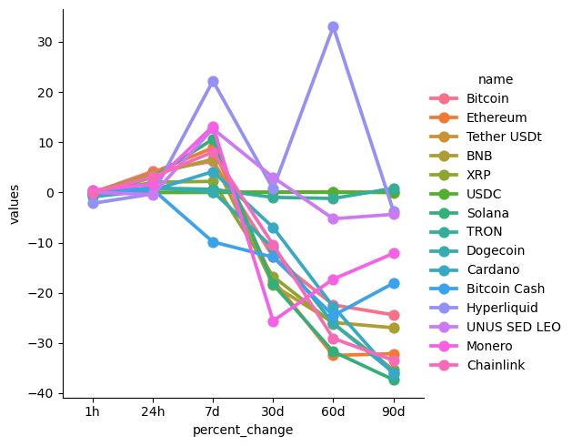
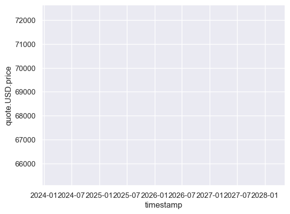

```python
from requests import Request, Session
from requests.exceptions import ConnectionError, Timeout, TooManyRedirects
import json

url = 'https://pro-api.coinmarketcap.com/v1/cryptocurrency/listings/latest' 
#Original Sandbox Environment: 'https://pro-api.coinmarketcap.com'
parameters = {
  'start':'1',
  'limit':'15',
  'convert':'USD'
}
headers = {
  'Accepts': 'application/json',
  'X-CMC_PRO_API_KEY': 'f2f6372e072f47818bab3d9181f66b66',
}

session = Session()
session.headers.update(headers)

try:
  response = session.get(url, params=parameters)
  data = json.loads(response.text)
  #print(data)
except (ConnectionError, Timeout, TooManyRedirects) as e:
  print(e)

#NOTE:
# I had to go in and put "jupyter notebook --NotebookApp.iopub_data_rate_limit=1e10"
# Into the Anaconda Prompt to change this to allow to pull data

# If that didn't work try using the local host URL as shown in the video

```


```python
type(data)
```


    dict


```python
import pandas as pd

#This allows you to see all the columns, not just like 15
pd.set_option('display.max_columns', None)
pd.set_option('display.max_rows', None)

```


```python
#This normalizes the data and makes it all pretty in a dataframe

df = pd.json_normalize(data['data'])
df['timestamp'] = pd.to_datetime('now')
df
```


<div>
<style scoped>
    .dataframe tbody tr th:only-of-type {
        vertical-align: middle;
    }

    .dataframe tbody tr th {
        vertical-align: top;
    }

    .dataframe thead th {
        text-align: right;
    }
</style>
<table border="1" class="dataframe">
  <thead>
    <tr style="text-align: right;">
      <th></th>
      <th>id</th>
      <th>name</th>
      <th>symbol</th>
      <th>slug</th>
      <th>num_market_pairs</th>
      <th>date_added</th>
      <th>tags</th>
      <th>max_supply</th>
      <th>circulating_supply</th>
      <th>total_supply</th>
      <th>infinite_supply</th>
      <th>minted_market_cap</th>
      <th>platform</th>
      <th>cmc_rank</th>
      <th>self_reported_circulating_supply</th>
      <th>self_reported_market_cap</th>
      <th>tvl_ratio</th>
      <th>last_updated</th>
      <th>quote.USD.price</th>
      <th>quote.USD.volume_24h</th>
      <th>quote.USD.cex_volume_24h</th>
      <th>quote.USD.dex_volume_24h</th>
      <th>quote.USD.volume_change_24h</th>
      <th>quote.USD.percent_change_1h</th>
      <th>quote.USD.percent_change_24h</th>
      <th>quote.USD.percent_change_7d</th>
      <th>quote.USD.percent_change_30d</th>
      <th>quote.USD.percent_change_60d</th>
      <th>quote.USD.percent_change_90d</th>
      <th>quote.USD.market_cap</th>
      <th>quote.USD.market_cap_dominance</th>
      <th>quote.USD.fully_diluted_market_cap</th>
      <th>quote.USD.tvl</th>
      <th>quote.USD.last_updated</th>
      <th>platform.id</th>
      <th>platform.name</th>
      <th>platform.symbol</th>
      <th>platform.slug</th>
      <th>platform.token_address</th>
      <th>timestamp</th>
    </tr>
  </thead>
  <tbody>
    <tr>
      <th>0</th>
      <td>1</td>
      <td>Bitcoin</td>
      <td>BTC</td>
      <td>bitcoin</td>
      <td>12570</td>
      <td>2010-07-13T00:00:00.000Z</td>
      <td>[mineable, pow, sha-256, store-of-value, state...</td>
      <td>2.100000e+07</td>
      <td>1.999706e+07</td>
      <td>1.999706e+07</td>
      <td>False</td>
      <td>1.376938e+12</td>
      <td>NaN</td>
      <td>1</td>
      <td>NaN</td>
      <td>NaN</td>
      <td>None</td>
      <td>2026-03-03T00:33:00.000Z</td>
      <td>68857.035932</td>
      <td>5.625929e+10</td>
      <td>5.618544e+10</td>
      <td>7.385086e+07</td>
      <td>38.1176</td>
      <td>-0.054100</td>
      <td>4.187991</td>
      <td>6.201123</td>
      <td>-12.821637</td>
      <td>-22.418270</td>
      <td>-24.399389</td>
      <td>1.376938e+12</td>
      <td>58.5607</td>
      <td>1.445998e+12</td>
      <td>None</td>
      <td>2026-03-03T00:33:00.000Z</td>
      <td>NaN</td>
      <td>NaN</td>
      <td>NaN</td>
      <td>NaN</td>
      <td>NaN</td>
      <td>2026-03-02 19:37:28.384869</td>
    </tr>
    <tr>
      <th>1</th>
      <td>1027</td>
      <td>Ethereum</td>
      <td>ETH</td>
      <td>ethereum</td>
      <td>11601</td>
      <td>2015-08-07T00:00:00.000Z</td>
      <td>[pos, smart-contracts, ethereum-ecosystem, coi...</td>
      <td>NaN</td>
      <td>1.206922e+08</td>
      <td>1.206922e+08</td>
      <td>True</td>
      <td>2.447853e+11</td>
      <td>NaN</td>
      <td>2</td>
      <td>NaN</td>
      <td>NaN</td>
      <td>None</td>
      <td>2026-03-03T00:33:00.000Z</td>
      <td>2028.178402</td>
      <td>2.611026e+10</td>
      <td>2.588299e+10</td>
      <td>2.272687e+08</td>
      <td>10.3333</td>
      <td>-0.321957</td>
      <td>3.954413</td>
      <td>8.875738</td>
      <td>-17.466111</td>
      <td>-32.478385</td>
      <td>-32.140366</td>
      <td>2.447853e+11</td>
      <td>10.4106</td>
      <td>2.447853e+11</td>
      <td>None</td>
      <td>2026-03-03T00:33:00.000Z</td>
      <td>NaN</td>
      <td>NaN</td>
      <td>NaN</td>
      <td>NaN</td>
      <td>NaN</td>
      <td>2026-03-02 19:37:28.384869</td>
    </tr>
    <tr>
      <th>2</th>
      <td>825</td>
      <td>Tether USDt</td>
      <td>USDT</td>
      <td>tether</td>
      <td>172235</td>
      <td>2015-02-25T00:00:00.000Z</td>
      <td>[stablecoin, asset-backed-stablecoin, usd-stab...</td>
      <td>NaN</td>
      <td>1.836339e+11</td>
      <td>1.879382e+11</td>
      <td>True</td>
      <td>1.879409e+11</td>
      <td>NaN</td>
      <td>3</td>
      <td>NaN</td>
      <td>NaN</td>
      <td>None</td>
      <td>2026-03-03T00:33:00.000Z</td>
      <td>1.000014</td>
      <td>1.068994e+11</td>
      <td>1.044749e+11</td>
      <td>2.424524e+09</td>
      <td>27.8601</td>
      <td>-0.013037</td>
      <td>-0.003208</td>
      <td>0.032904</td>
      <td>0.070085</td>
      <td>0.123655</td>
      <td>-0.027926</td>
      <td>1.836365e+11</td>
      <td>7.8100</td>
      <td>1.879409e+11</td>
      <td>None</td>
      <td>2026-03-03T00:33:00.000Z</td>
      <td>1027.0</td>
      <td>Ethereum</td>
      <td>ETH</td>
      <td>ethereum</td>
      <td>0xdac17f958d2ee523a2206206994597c13d831ec7</td>
      <td>2026-03-02 19:37:28.384869</td>
    </tr>
    <tr>
      <th>3</th>
      <td>1839</td>
      <td>BNB</td>
      <td>BNB</td>
      <td>bnb</td>
      <td>3138</td>
      <td>2017-07-25T00:00:00.000Z</td>
      <td>[marketplace, centralized-exchange, payments, ...</td>
      <td>1.363587e+08</td>
      <td>1.363587e+08</td>
      <td>1.363587e+08</td>
      <td>False</td>
      <td>8.709485e+10</td>
      <td>NaN</td>
      <td>4</td>
      <td>NaN</td>
      <td>NaN</td>
      <td>None</td>
      <td>2026-03-03T00:34:00.000Z</td>
      <td>638.718835</td>
      <td>1.917936e+09</td>
      <td>1.866031e+09</td>
      <td>5.190489e+07</td>
      <td>-0.3712</td>
      <td>0.069982</td>
      <td>3.591520</td>
      <td>6.621242</td>
      <td>-18.471974</td>
      <td>-25.917099</td>
      <td>-26.973121</td>
      <td>8.709485e+10</td>
      <td>3.7041</td>
      <td>8.709485e+10</td>
      <td>None</td>
      <td>2026-03-03T00:34:00.000Z</td>
      <td>NaN</td>
      <td>NaN</td>
      <td>NaN</td>
      <td>NaN</td>
      <td>NaN</td>
      <td>2026-03-02 19:37:28.384869</td>
    </tr>
    <tr>
      <th>4</th>
      <td>52</td>
      <td>XRP</td>
      <td>XRP</td>
      <td>xrp</td>
      <td>1804</td>
      <td>2013-08-04T00:00:00.000Z</td>
      <td>[medium-of-exchange, enterprise-solutions, xrp...</td>
      <td>1.000000e+11</td>
      <td>6.109038e+10</td>
      <td>9.998571e+10</td>
      <td>False</td>
      <td>1.385367e+11</td>
      <td>NaN</td>
      <td>5</td>
      <td>NaN</td>
      <td>NaN</td>
      <td>None</td>
      <td>2026-03-03T00:33:00.000Z</td>
      <td>1.385565</td>
      <td>3.317952e+09</td>
      <td>3.314575e+09</td>
      <td>3.376737e+06</td>
      <td>-0.8993</td>
      <td>-0.351742</td>
      <td>2.035115</td>
      <td>2.194310</td>
      <td>-16.751409</td>
      <td>-26.147041</td>
      <td>-35.366676</td>
      <td>8.464471e+10</td>
      <td>3.5999</td>
      <td>1.385565e+11</td>
      <td>None</td>
      <td>2026-03-03T00:33:00.000Z</td>
      <td>NaN</td>
      <td>NaN</td>
      <td>NaN</td>
      <td>NaN</td>
      <td>NaN</td>
      <td>2026-03-02 19:37:28.384869</td>
    </tr>
    <tr>
      <th>5</th>
      <td>3408</td>
      <td>USDC</td>
      <td>USDC</td>
      <td>usd-coin</td>
      <td>37767</td>
      <td>2018-10-08T00:00:00.000Z</td>
      <td>[medium-of-exchange, stablecoin, asset-backed-...</td>
      <td>NaN</td>
      <td>7.593792e+10</td>
      <td>7.593792e+10</td>
      <td>False</td>
      <td>7.593767e+10</td>
      <td>NaN</td>
      <td>6</td>
      <td>6.090122e+10</td>
      <td>6.090102e+10</td>
      <td>None</td>
      <td>2026-03-03T00:33:00.000Z</td>
      <td>0.999997</td>
      <td>1.783812e+10</td>
      <td>1.435167e+10</td>
      <td>3.486452e+09</td>
      <td>76.6873</td>
      <td>-0.021651</td>
      <td>0.002891</td>
      <td>0.000850</td>
      <td>0.040457</td>
      <td>0.014041</td>
      <td>0.016019</td>
      <td>7.593767e+10</td>
      <td>3.2296</td>
      <td>7.593767e+10</td>
      <td>None</td>
      <td>2026-03-03T00:33:00.000Z</td>
      <td>1027.0</td>
      <td>Ethereum</td>
      <td>ETH</td>
      <td>ethereum</td>
      <td>0xa0b86991c6218b36c1d19d4a2e9eb0ce3606eb48</td>
      <td>2026-03-02 19:37:28.384869</td>
    </tr>
    <tr>
      <th>6</th>
      <td>5426</td>
      <td>Solana</td>
      <td>SOL</td>
      <td>solana</td>
      <td>1093</td>
      <td>2020-04-10T00:00:00.000Z</td>
      <td>[pos, platform, solana-ecosystem, cms-holdings...</td>
      <td>NaN</td>
      <td>5.696462e+08</td>
      <td>6.214645e+08</td>
      <td>True</td>
      <td>5.375318e+10</td>
      <td>NaN</td>
      <td>7</td>
      <td>5.252369e+08</td>
      <td>4.543003e+10</td>
      <td>None</td>
      <td>2026-03-03T00:33:00.000Z</td>
      <td>86.494369</td>
      <td>5.470537e+09</td>
      <td>5.470505e+09</td>
      <td>3.194702e+04</td>
      <td>17.9415</td>
      <td>-0.490898</td>
      <td>3.007309</td>
      <td>10.606469</td>
      <td>-18.329027</td>
      <td>-31.725201</td>
      <td>-37.326044</td>
      <td>4.927119e+10</td>
      <td>2.0955</td>
      <td>5.375318e+10</td>
      <td>None</td>
      <td>2026-03-03T00:33:00.000Z</td>
      <td>NaN</td>
      <td>NaN</td>
      <td>NaN</td>
      <td>NaN</td>
      <td>NaN</td>
      <td>2026-03-02 19:37:28.384869</td>
    </tr>
    <tr>
      <th>7</th>
      <td>1958</td>
      <td>TRON</td>
      <td>TRX</td>
      <td>tron</td>
      <td>1303</td>
      <td>2017-09-13T00:00:00.000Z</td>
      <td>[media, payments, tron-ecosystem, layer-1, dwf...</td>
      <td>NaN</td>
      <td>9.474153e+10</td>
      <td>9.474152e+10</td>
      <td>True</td>
      <td>2.683525e+10</td>
      <td>NaN</td>
      <td>8</td>
      <td>9.466789e+10</td>
      <td>2.681440e+10</td>
      <td>None</td>
      <td>2026-03-03T00:33:00.000Z</td>
      <td>0.283247</td>
      <td>4.546976e+08</td>
      <td>4.544927e+08</td>
      <td>2.048924e+05</td>
      <td>5.1586</td>
      <td>0.007003</td>
      <td>0.859532</td>
      <td>0.629343</td>
      <td>-0.985089</td>
      <td>-1.206568</td>
      <td>0.830156</td>
      <td>2.683526e+10</td>
      <td>1.1413</td>
      <td>2.683525e+10</td>
      <td>None</td>
      <td>2026-03-03T00:33:00.000Z</td>
      <td>NaN</td>
      <td>NaN</td>
      <td>NaN</td>
      <td>NaN</td>
      <td>NaN</td>
      <td>2026-03-02 19:37:28.384869</td>
    </tr>
    <tr>
      <th>8</th>
      <td>74</td>
      <td>Dogecoin</td>
      <td>DOGE</td>
      <td>dogecoin</td>
      <td>1406</td>
      <td>2013-12-15T00:00:00.000Z</td>
      <td>[mineable, pow, scrypt, medium-of-exchange, me...</td>
      <td>NaN</td>
      <td>1.689607e+11</td>
      <td>1.689607e+11</td>
      <td>True</td>
      <td>1.574962e+10</td>
      <td>NaN</td>
      <td>9</td>
      <td>NaN</td>
      <td>NaN</td>
      <td>None</td>
      <td>2026-03-03T00:34:00.000Z</td>
      <td>0.093215</td>
      <td>1.242005e+09</td>
      <td>1.239174e+09</td>
      <td>2.831542e+06</td>
      <td>-5.2824</td>
      <td>-0.306161</td>
      <td>0.926201</td>
      <td>0.141154</td>
      <td>-11.083904</td>
      <td>-26.108666</td>
      <td>-35.902621</td>
      <td>1.574962e+10</td>
      <td>0.6698</td>
      <td>1.574962e+10</td>
      <td>None</td>
      <td>2026-03-03T00:34:00.000Z</td>
      <td>NaN</td>
      <td>NaN</td>
      <td>NaN</td>
      <td>NaN</td>
      <td>NaN</td>
      <td>2026-03-02 19:37:28.384869</td>
    </tr>
    <tr>
      <th>9</th>
      <td>2010</td>
      <td>Cardano</td>
      <td>ADA</td>
      <td>cardano</td>
      <td>1686</td>
      <td>2017-10-01T00:00:00.000Z</td>
      <td>[dpos, pos, platform, research, smart-contract...</td>
      <td>4.500000e+10</td>
      <td>3.607886e+10</td>
      <td>4.499484e+10</td>
      <td>False</td>
      <td>1.236393e+10</td>
      <td>NaN</td>
      <td>10</td>
      <td>3.799790e+10</td>
      <td>1.044128e+10</td>
      <td>None</td>
      <td>2026-03-03T00:33:00.000Z</td>
      <td>0.274786</td>
      <td>6.233569e+08</td>
      <td>6.215896e+08</td>
      <td>1.767271e+06</td>
      <td>4.4255</td>
      <td>-0.889325</td>
      <td>0.439038</td>
      <td>4.146580</td>
      <td>-6.970730</td>
      <td>-22.765836</td>
      <td>-36.210632</td>
      <td>9.913952e+09</td>
      <td>0.4216</td>
      <td>1.236535e+10</td>
      <td>None</td>
      <td>2026-03-03T00:33:00.000Z</td>
      <td>NaN</td>
      <td>NaN</td>
      <td>NaN</td>
      <td>NaN</td>
      <td>NaN</td>
      <td>2026-03-02 19:37:28.384869</td>
    </tr>
    <tr>
      <th>10</th>
      <td>1831</td>
      <td>Bitcoin Cash</td>
      <td>BCH</td>
      <td>bitcoin-cash</td>
      <td>1140</td>
      <td>2017-07-23T00:00:00.000Z</td>
      <td>[mineable, pow, sha-256, marketplace, medium-o...</td>
      <td>2.100000e+07</td>
      <td>2.000200e+07</td>
      <td>2.000200e+07</td>
      <td>False</td>
      <td>8.916770e+09</td>
      <td>NaN</td>
      <td>11</td>
      <td>NaN</td>
      <td>NaN</td>
      <td>None</td>
      <td>2026-03-03T00:33:00.000Z</td>
      <td>445.793911</td>
      <td>4.038739e+08</td>
      <td>4.016749e+08</td>
      <td>2.198935e+06</td>
      <td>21.9442</td>
      <td>0.451338</td>
      <td>0.615199</td>
      <td>-9.863928</td>
      <td>-12.897950</td>
      <td>-24.533705</td>
      <td>-18.090939</td>
      <td>8.916770e+09</td>
      <td>0.3792</td>
      <td>9.361672e+09</td>
      <td>None</td>
      <td>2026-03-03T00:33:00.000Z</td>
      <td>NaN</td>
      <td>NaN</td>
      <td>NaN</td>
      <td>NaN</td>
      <td>NaN</td>
      <td>2026-03-02 19:37:28.384869</td>
    </tr>
    <tr>
      <th>11</th>
      <td>32196</td>
      <td>Hyperliquid</td>
      <td>HYPE</td>
      <td>hyperliquid</td>
      <td>241</td>
      <td>2024-07-15T10:14:50.000Z</td>
      <td>[decentralized-exchange-dex-token, defi, deriv...</td>
      <td>9.616715e+08</td>
      <td>2.580386e+08</td>
      <td>9.576744e+08</td>
      <td>False</td>
      <td>3.097895e+10</td>
      <td>NaN</td>
      <td>12</td>
      <td>3.339317e+08</td>
      <td>1.080206e+10</td>
      <td>None</td>
      <td>2026-03-03T00:33:00.000Z</td>
      <td>32.348106</td>
      <td>4.080524e+08</td>
      <td>3.200739e+08</td>
      <td>8.797844e+07</td>
      <td>23.3790</td>
      <td>-2.182418</td>
      <td>-0.304097</td>
      <td>22.226014</td>
      <td>0.715839</td>
      <td>33.005753</td>
      <td>-3.736409</td>
      <td>8.347060e+09</td>
      <td>0.3550</td>
      <td>3.110825e+10</td>
      <td>None</td>
      <td>2026-03-03T00:33:00.000Z</td>
      <td>32196.0</td>
      <td>Hyperliquid</td>
      <td>HYPE</td>
      <td>hyperliquid</td>
      <td>0x0d01dc56dcaaca66ad901c959b4011ec</td>
      <td>2026-03-02 19:37:28.384869</td>
    </tr>
    <tr>
      <th>12</th>
      <td>3957</td>
      <td>UNUS SED LEO</td>
      <td>LEO</td>
      <td>unus-sed-leo</td>
      <td>67</td>
      <td>2019-05-21T00:00:00.000Z</td>
      <td>[marketplace, centralized-exchange, discount-t...</td>
      <td>NaN</td>
      <td>9.212425e+08</td>
      <td>9.852395e+08</td>
      <td>False</td>
      <td>8.928112e+09</td>
      <td>NaN</td>
      <td>13</td>
      <td>NaN</td>
      <td>NaN</td>
      <td>None</td>
      <td>2026-03-03T00:34:00.000Z</td>
      <td>9.061870</td>
      <td>2.300202e+06</td>
      <td>2.300202e+06</td>
      <td>0.000000e+00</td>
      <td>89.6983</td>
      <td>0.043147</td>
      <td>-0.435366</td>
      <td>12.679653</td>
      <td>3.007554</td>
      <td>-5.252790</td>
      <td>-4.370491</td>
      <td>8.348179e+09</td>
      <td>0.3550</td>
      <td>8.928112e+09</td>
      <td>None</td>
      <td>2026-03-03T00:34:00.000Z</td>
      <td>1027.0</td>
      <td>Ethereum</td>
      <td>ETH</td>
      <td>ethereum</td>
      <td>0x2af5d2ad76741191d15dfe7bf6ac92d4bd912ca3</td>
      <td>2026-03-02 19:37:28.384869</td>
    </tr>
    <tr>
      <th>13</th>
      <td>328</td>
      <td>Monero</td>
      <td>XMR</td>
      <td>monero</td>
      <td>362</td>
      <td>2014-05-21T00:00:00.000Z</td>
      <td>[mineable, pow, medium-of-exchange, privacy, r...</td>
      <td>NaN</td>
      <td>1.844674e+07</td>
      <td>1.844674e+07</td>
      <td>True</td>
      <td>6.387872e+09</td>
      <td>NaN</td>
      <td>14</td>
      <td>NaN</td>
      <td>NaN</td>
      <td>None</td>
      <td>2026-03-03T00:33:00.000Z</td>
      <td>346.287212</td>
      <td>9.666015e+07</td>
      <td>9.666015e+07</td>
      <td>0.000000e+00</td>
      <td>29.2655</td>
      <td>0.419385</td>
      <td>1.648503</td>
      <td>13.196859</td>
      <td>-25.618311</td>
      <td>-17.275300</td>
      <td>-12.153095</td>
      <td>6.387872e+09</td>
      <td>0.2717</td>
      <td>6.387872e+09</td>
      <td>None</td>
      <td>2026-03-03T00:33:00.000Z</td>
      <td>NaN</td>
      <td>NaN</td>
      <td>NaN</td>
      <td>NaN</td>
      <td>NaN</td>
      <td>2026-03-02 19:37:28.384869</td>
    </tr>
    <tr>
      <th>14</th>
      <td>1975</td>
      <td>Chainlink</td>
      <td>LINK</td>
      <td>chainlink</td>
      <td>2215</td>
      <td>2017-09-20T00:00:00.000Z</td>
      <td>[platform, cosmos-ecosystem, defi, privacy, in...</td>
      <td>1.000000e+09</td>
      <td>7.081000e+08</td>
      <td>1.000000e+09</td>
      <td>False</td>
      <td>8.959073e+09</td>
      <td>NaN</td>
      <td>15</td>
      <td>NaN</td>
      <td>NaN</td>
      <td>None</td>
      <td>2026-03-03T00:34:00.000Z</td>
      <td>8.959073</td>
      <td>8.540932e+08</td>
      <td>8.459821e+08</td>
      <td>8.111149e+06</td>
      <td>9.2411</td>
      <td>-0.048005</td>
      <td>3.071565</td>
      <td>8.046155</td>
      <td>-10.424449</td>
      <td>-29.081196</td>
      <td>-33.473697</td>
      <td>6.343919e+09</td>
      <td>0.2698</td>
      <td>8.959073e+09</td>
      <td>None</td>
      <td>2026-03-03T00:34:00.000Z</td>
      <td>1027.0</td>
      <td>Ethereum</td>
      <td>ETH</td>
      <td>ethereum</td>
      <td>0x514910771af9ca656af840dff83e8264ecf986ca</td>
      <td>2026-03-02 19:37:28.384869</td>
    </tr>
  </tbody>
</table>
</div>


```python
def api_runner():
    
    url = 'https://pro-api.coinmarketcap.com/v1/cryptocurrency/listings/latest' 
    #Original Sandbox Environment: 'https://pro-api.coinmarketcap.com'
    parameters = {
      'start':'1',
      'limit':'15',
      'convert':'USD'
    }
    headers = {
      'Accepts': 'application/json',
      'X-CMC_PRO_API_KEY': 'f2f6372e072f47818bab3d9181f66b66',
    }
    
    session = Session()
    session.headers.update(headers)
    
    try:
      response = session.get(url, params=parameters)
      data = json.loads(response.text)
      #print(data)
    except (ConnectionError, Timeout, TooManyRedirects) as e:
      print(e)

#NOTE:
# I had to go in and put "jupyter notebook --NotebookApp.iopub_data_rate_limit=1e10"
# Into the Anaconda Prompt to change this to allow to pull data

    df2 = pd.json_normalize(data['data'])
    df2['timestamp'] = pd.to_datetime('now')
    df_append = pd.DataFrame(df2)
    df = pd.concat([df2,df_append])

# Use this if you want to create a csv and append data to it
#df = pd.json_normalize(data['data'])
#df['timestamp'] = pd.to_datetime('now')
#df

#if not os.path.isfile(r'C:\Users\alexf\OneDrive\Documents\Python Scripts\API.csv'):
        #df.to_csv(r'C:\Users\alexf\OneDrive\Documents\Python Scripts\API.csv', header='column_names')
    #else:
        #df.to_csv(r'C:\Users\alexf\OneDrive\Documents\Python Scripts\API.csv', mode='a', header=False)

# If that didn't work try using the local host URL as shown in the video

```


```python
import os 
from time import time
from time import sleep

for i in range(333):
    api_runner()
    print('API Runner completed successfully')
    sleep(60) #sleep for 1 minute
exit()
```

    API Runner completed successfully
    API Runner completed successfully
    API Runner completed successfully
    API Runner completed successfully
    


    ---------------------------------------------------------------------------

    KeyboardInterrupt                         Traceback (most recent call last)

    Cell In[6], line 8
          6     api_runner()
          7     print('API Runner completed successfully')
    ----> 8     sleep(60) #sleep for 1 minute
          9 exit()
    

    KeyboardInterrupt: 


```python
df
```


<div>
<style scoped>
    .dataframe tbody tr th:only-of-type {
        vertical-align: middle;
    }

    .dataframe tbody tr th {
        vertical-align: top;
    }

    .dataframe thead th {
        text-align: right;
    }
</style>
<table border="1" class="dataframe">
  <thead>
    <tr style="text-align: right;">
      <th></th>
      <th>id</th>
      <th>name</th>
      <th>symbol</th>
      <th>slug</th>
      <th>num_market_pairs</th>
      <th>date_added</th>
      <th>tags</th>
      <th>max_supply</th>
      <th>circulating_supply</th>
      <th>total_supply</th>
      <th>infinite_supply</th>
      <th>minted_market_cap</th>
      <th>platform</th>
      <th>cmc_rank</th>
      <th>self_reported_circulating_supply</th>
      <th>self_reported_market_cap</th>
      <th>tvl_ratio</th>
      <th>last_updated</th>
      <th>quote.USD.price</th>
      <th>quote.USD.volume_24h</th>
      <th>quote.USD.cex_volume_24h</th>
      <th>quote.USD.dex_volume_24h</th>
      <th>quote.USD.volume_change_24h</th>
      <th>quote.USD.percent_change_1h</th>
      <th>quote.USD.percent_change_24h</th>
      <th>quote.USD.percent_change_7d</th>
      <th>quote.USD.percent_change_30d</th>
      <th>quote.USD.percent_change_60d</th>
      <th>quote.USD.percent_change_90d</th>
      <th>quote.USD.market_cap</th>
      <th>quote.USD.market_cap_dominance</th>
      <th>quote.USD.fully_diluted_market_cap</th>
      <th>quote.USD.tvl</th>
      <th>quote.USD.last_updated</th>
      <th>platform.id</th>
      <th>platform.name</th>
      <th>platform.symbol</th>
      <th>platform.slug</th>
      <th>platform.token_address</th>
      <th>timestamp</th>
    </tr>
  </thead>
  <tbody>
    <tr>
      <th>0</th>
      <td>1</td>
      <td>Bitcoin</td>
      <td>BTC</td>
      <td>bitcoin</td>
      <td>12570</td>
      <td>2010-07-13T00:00:00.000Z</td>
      <td>[mineable, pow, sha-256, store-of-value, state...</td>
      <td>2.100000e+07</td>
      <td>1.999706e+07</td>
      <td>1.999706e+07</td>
      <td>False</td>
      <td>1.376938e+12</td>
      <td>NaN</td>
      <td>1</td>
      <td>NaN</td>
      <td>NaN</td>
      <td>None</td>
      <td>2026-03-03T00:33:00.000Z</td>
      <td>68857.035932</td>
      <td>5.625929e+10</td>
      <td>5.618544e+10</td>
      <td>7.385086e+07</td>
      <td>38.1176</td>
      <td>-0.054100</td>
      <td>4.187991</td>
      <td>6.201123</td>
      <td>-12.821637</td>
      <td>-22.418270</td>
      <td>-24.399389</td>
      <td>1.376938e+12</td>
      <td>58.5607</td>
      <td>1.445998e+12</td>
      <td>None</td>
      <td>2026-03-03T00:33:00.000Z</td>
      <td>NaN</td>
      <td>NaN</td>
      <td>NaN</td>
      <td>NaN</td>
      <td>NaN</td>
      <td>2026-03-02 19:37:28.384869</td>
    </tr>
    <tr>
      <th>1</th>
      <td>1027</td>
      <td>Ethereum</td>
      <td>ETH</td>
      <td>ethereum</td>
      <td>11601</td>
      <td>2015-08-07T00:00:00.000Z</td>
      <td>[pos, smart-contracts, ethereum-ecosystem, coi...</td>
      <td>NaN</td>
      <td>1.206922e+08</td>
      <td>1.206922e+08</td>
      <td>True</td>
      <td>2.447853e+11</td>
      <td>NaN</td>
      <td>2</td>
      <td>NaN</td>
      <td>NaN</td>
      <td>None</td>
      <td>2026-03-03T00:33:00.000Z</td>
      <td>2028.178402</td>
      <td>2.611026e+10</td>
      <td>2.588299e+10</td>
      <td>2.272687e+08</td>
      <td>10.3333</td>
      <td>-0.321957</td>
      <td>3.954413</td>
      <td>8.875738</td>
      <td>-17.466111</td>
      <td>-32.478385</td>
      <td>-32.140366</td>
      <td>2.447853e+11</td>
      <td>10.4106</td>
      <td>2.447853e+11</td>
      <td>None</td>
      <td>2026-03-03T00:33:00.000Z</td>
      <td>NaN</td>
      <td>NaN</td>
      <td>NaN</td>
      <td>NaN</td>
      <td>NaN</td>
      <td>2026-03-02 19:37:28.384869</td>
    </tr>
    <tr>
      <th>2</th>
      <td>825</td>
      <td>Tether USDt</td>
      <td>USDT</td>
      <td>tether</td>
      <td>172235</td>
      <td>2015-02-25T00:00:00.000Z</td>
      <td>[stablecoin, asset-backed-stablecoin, usd-stab...</td>
      <td>NaN</td>
      <td>1.836339e+11</td>
      <td>1.879382e+11</td>
      <td>True</td>
      <td>1.879409e+11</td>
      <td>NaN</td>
      <td>3</td>
      <td>NaN</td>
      <td>NaN</td>
      <td>None</td>
      <td>2026-03-03T00:33:00.000Z</td>
      <td>1.000014</td>
      <td>1.068994e+11</td>
      <td>1.044749e+11</td>
      <td>2.424524e+09</td>
      <td>27.8601</td>
      <td>-0.013037</td>
      <td>-0.003208</td>
      <td>0.032904</td>
      <td>0.070085</td>
      <td>0.123655</td>
      <td>-0.027926</td>
      <td>1.836365e+11</td>
      <td>7.8100</td>
      <td>1.879409e+11</td>
      <td>None</td>
      <td>2026-03-03T00:33:00.000Z</td>
      <td>1027.0</td>
      <td>Ethereum</td>
      <td>ETH</td>
      <td>ethereum</td>
      <td>0xdac17f958d2ee523a2206206994597c13d831ec7</td>
      <td>2026-03-02 19:37:28.384869</td>
    </tr>
    <tr>
      <th>3</th>
      <td>1839</td>
      <td>BNB</td>
      <td>BNB</td>
      <td>bnb</td>
      <td>3138</td>
      <td>2017-07-25T00:00:00.000Z</td>
      <td>[marketplace, centralized-exchange, payments, ...</td>
      <td>1.363587e+08</td>
      <td>1.363587e+08</td>
      <td>1.363587e+08</td>
      <td>False</td>
      <td>8.709485e+10</td>
      <td>NaN</td>
      <td>4</td>
      <td>NaN</td>
      <td>NaN</td>
      <td>None</td>
      <td>2026-03-03T00:34:00.000Z</td>
      <td>638.718835</td>
      <td>1.917936e+09</td>
      <td>1.866031e+09</td>
      <td>5.190489e+07</td>
      <td>-0.3712</td>
      <td>0.069982</td>
      <td>3.591520</td>
      <td>6.621242</td>
      <td>-18.471974</td>
      <td>-25.917099</td>
      <td>-26.973121</td>
      <td>8.709485e+10</td>
      <td>3.7041</td>
      <td>8.709485e+10</td>
      <td>None</td>
      <td>2026-03-03T00:34:00.000Z</td>
      <td>NaN</td>
      <td>NaN</td>
      <td>NaN</td>
      <td>NaN</td>
      <td>NaN</td>
      <td>2026-03-02 19:37:28.384869</td>
    </tr>
    <tr>
      <th>4</th>
      <td>52</td>
      <td>XRP</td>
      <td>XRP</td>
      <td>xrp</td>
      <td>1804</td>
      <td>2013-08-04T00:00:00.000Z</td>
      <td>[medium-of-exchange, enterprise-solutions, xrp...</td>
      <td>1.000000e+11</td>
      <td>6.109038e+10</td>
      <td>9.998571e+10</td>
      <td>False</td>
      <td>1.385367e+11</td>
      <td>NaN</td>
      <td>5</td>
      <td>NaN</td>
      <td>NaN</td>
      <td>None</td>
      <td>2026-03-03T00:33:00.000Z</td>
      <td>1.385565</td>
      <td>3.317952e+09</td>
      <td>3.314575e+09</td>
      <td>3.376737e+06</td>
      <td>-0.8993</td>
      <td>-0.351742</td>
      <td>2.035115</td>
      <td>2.194310</td>
      <td>-16.751409</td>
      <td>-26.147041</td>
      <td>-35.366676</td>
      <td>8.464471e+10</td>
      <td>3.5999</td>
      <td>1.385565e+11</td>
      <td>None</td>
      <td>2026-03-03T00:33:00.000Z</td>
      <td>NaN</td>
      <td>NaN</td>
      <td>NaN</td>
      <td>NaN</td>
      <td>NaN</td>
      <td>2026-03-02 19:37:28.384869</td>
    </tr>
    <tr>
      <th>5</th>
      <td>3408</td>
      <td>USDC</td>
      <td>USDC</td>
      <td>usd-coin</td>
      <td>37767</td>
      <td>2018-10-08T00:00:00.000Z</td>
      <td>[medium-of-exchange, stablecoin, asset-backed-...</td>
      <td>NaN</td>
      <td>7.593792e+10</td>
      <td>7.593792e+10</td>
      <td>False</td>
      <td>7.593767e+10</td>
      <td>NaN</td>
      <td>6</td>
      <td>6.090122e+10</td>
      <td>6.090102e+10</td>
      <td>None</td>
      <td>2026-03-03T00:33:00.000Z</td>
      <td>0.999997</td>
      <td>1.783812e+10</td>
      <td>1.435167e+10</td>
      <td>3.486452e+09</td>
      <td>76.6873</td>
      <td>-0.021651</td>
      <td>0.002891</td>
      <td>0.000850</td>
      <td>0.040457</td>
      <td>0.014041</td>
      <td>0.016019</td>
      <td>7.593767e+10</td>
      <td>3.2296</td>
      <td>7.593767e+10</td>
      <td>None</td>
      <td>2026-03-03T00:33:00.000Z</td>
      <td>1027.0</td>
      <td>Ethereum</td>
      <td>ETH</td>
      <td>ethereum</td>
      <td>0xa0b86991c6218b36c1d19d4a2e9eb0ce3606eb48</td>
      <td>2026-03-02 19:37:28.384869</td>
    </tr>
    <tr>
      <th>6</th>
      <td>5426</td>
      <td>Solana</td>
      <td>SOL</td>
      <td>solana</td>
      <td>1093</td>
      <td>2020-04-10T00:00:00.000Z</td>
      <td>[pos, platform, solana-ecosystem, cms-holdings...</td>
      <td>NaN</td>
      <td>5.696462e+08</td>
      <td>6.214645e+08</td>
      <td>True</td>
      <td>5.375318e+10</td>
      <td>NaN</td>
      <td>7</td>
      <td>5.252369e+08</td>
      <td>4.543003e+10</td>
      <td>None</td>
      <td>2026-03-03T00:33:00.000Z</td>
      <td>86.494369</td>
      <td>5.470537e+09</td>
      <td>5.470505e+09</td>
      <td>3.194702e+04</td>
      <td>17.9415</td>
      <td>-0.490898</td>
      <td>3.007309</td>
      <td>10.606469</td>
      <td>-18.329027</td>
      <td>-31.725201</td>
      <td>-37.326044</td>
      <td>4.927119e+10</td>
      <td>2.0955</td>
      <td>5.375318e+10</td>
      <td>None</td>
      <td>2026-03-03T00:33:00.000Z</td>
      <td>NaN</td>
      <td>NaN</td>
      <td>NaN</td>
      <td>NaN</td>
      <td>NaN</td>
      <td>2026-03-02 19:37:28.384869</td>
    </tr>
    <tr>
      <th>7</th>
      <td>1958</td>
      <td>TRON</td>
      <td>TRX</td>
      <td>tron</td>
      <td>1303</td>
      <td>2017-09-13T00:00:00.000Z</td>
      <td>[media, payments, tron-ecosystem, layer-1, dwf...</td>
      <td>NaN</td>
      <td>9.474153e+10</td>
      <td>9.474152e+10</td>
      <td>True</td>
      <td>2.683525e+10</td>
      <td>NaN</td>
      <td>8</td>
      <td>9.466789e+10</td>
      <td>2.681440e+10</td>
      <td>None</td>
      <td>2026-03-03T00:33:00.000Z</td>
      <td>0.283247</td>
      <td>4.546976e+08</td>
      <td>4.544927e+08</td>
      <td>2.048924e+05</td>
      <td>5.1586</td>
      <td>0.007003</td>
      <td>0.859532</td>
      <td>0.629343</td>
      <td>-0.985089</td>
      <td>-1.206568</td>
      <td>0.830156</td>
      <td>2.683526e+10</td>
      <td>1.1413</td>
      <td>2.683525e+10</td>
      <td>None</td>
      <td>2026-03-03T00:33:00.000Z</td>
      <td>NaN</td>
      <td>NaN</td>
      <td>NaN</td>
      <td>NaN</td>
      <td>NaN</td>
      <td>2026-03-02 19:37:28.384869</td>
    </tr>
    <tr>
      <th>8</th>
      <td>74</td>
      <td>Dogecoin</td>
      <td>DOGE</td>
      <td>dogecoin</td>
      <td>1406</td>
      <td>2013-12-15T00:00:00.000Z</td>
      <td>[mineable, pow, scrypt, medium-of-exchange, me...</td>
      <td>NaN</td>
      <td>1.689607e+11</td>
      <td>1.689607e+11</td>
      <td>True</td>
      <td>1.574962e+10</td>
      <td>NaN</td>
      <td>9</td>
      <td>NaN</td>
      <td>NaN</td>
      <td>None</td>
      <td>2026-03-03T00:34:00.000Z</td>
      <td>0.093215</td>
      <td>1.242005e+09</td>
      <td>1.239174e+09</td>
      <td>2.831542e+06</td>
      <td>-5.2824</td>
      <td>-0.306161</td>
      <td>0.926201</td>
      <td>0.141154</td>
      <td>-11.083904</td>
      <td>-26.108666</td>
      <td>-35.902621</td>
      <td>1.574962e+10</td>
      <td>0.6698</td>
      <td>1.574962e+10</td>
      <td>None</td>
      <td>2026-03-03T00:34:00.000Z</td>
      <td>NaN</td>
      <td>NaN</td>
      <td>NaN</td>
      <td>NaN</td>
      <td>NaN</td>
      <td>2026-03-02 19:37:28.384869</td>
    </tr>
    <tr>
      <th>9</th>
      <td>2010</td>
      <td>Cardano</td>
      <td>ADA</td>
      <td>cardano</td>
      <td>1686</td>
      <td>2017-10-01T00:00:00.000Z</td>
      <td>[dpos, pos, platform, research, smart-contract...</td>
      <td>4.500000e+10</td>
      <td>3.607886e+10</td>
      <td>4.499484e+10</td>
      <td>False</td>
      <td>1.236393e+10</td>
      <td>NaN</td>
      <td>10</td>
      <td>3.799790e+10</td>
      <td>1.044128e+10</td>
      <td>None</td>
      <td>2026-03-03T00:33:00.000Z</td>
      <td>0.274786</td>
      <td>6.233569e+08</td>
      <td>6.215896e+08</td>
      <td>1.767271e+06</td>
      <td>4.4255</td>
      <td>-0.889325</td>
      <td>0.439038</td>
      <td>4.146580</td>
      <td>-6.970730</td>
      <td>-22.765836</td>
      <td>-36.210632</td>
      <td>9.913952e+09</td>
      <td>0.4216</td>
      <td>1.236535e+10</td>
      <td>None</td>
      <td>2026-03-03T00:33:00.000Z</td>
      <td>NaN</td>
      <td>NaN</td>
      <td>NaN</td>
      <td>NaN</td>
      <td>NaN</td>
      <td>2026-03-02 19:37:28.384869</td>
    </tr>
    <tr>
      <th>10</th>
      <td>1831</td>
      <td>Bitcoin Cash</td>
      <td>BCH</td>
      <td>bitcoin-cash</td>
      <td>1140</td>
      <td>2017-07-23T00:00:00.000Z</td>
      <td>[mineable, pow, sha-256, marketplace, medium-o...</td>
      <td>2.100000e+07</td>
      <td>2.000200e+07</td>
      <td>2.000200e+07</td>
      <td>False</td>
      <td>8.916770e+09</td>
      <td>NaN</td>
      <td>11</td>
      <td>NaN</td>
      <td>NaN</td>
      <td>None</td>
      <td>2026-03-03T00:33:00.000Z</td>
      <td>445.793911</td>
      <td>4.038739e+08</td>
      <td>4.016749e+08</td>
      <td>2.198935e+06</td>
      <td>21.9442</td>
      <td>0.451338</td>
      <td>0.615199</td>
      <td>-9.863928</td>
      <td>-12.897950</td>
      <td>-24.533705</td>
      <td>-18.090939</td>
      <td>8.916770e+09</td>
      <td>0.3792</td>
      <td>9.361672e+09</td>
      <td>None</td>
      <td>2026-03-03T00:33:00.000Z</td>
      <td>NaN</td>
      <td>NaN</td>
      <td>NaN</td>
      <td>NaN</td>
      <td>NaN</td>
      <td>2026-03-02 19:37:28.384869</td>
    </tr>
    <tr>
      <th>11</th>
      <td>32196</td>
      <td>Hyperliquid</td>
      <td>HYPE</td>
      <td>hyperliquid</td>
      <td>241</td>
      <td>2024-07-15T10:14:50.000Z</td>
      <td>[decentralized-exchange-dex-token, defi, deriv...</td>
      <td>9.616715e+08</td>
      <td>2.580386e+08</td>
      <td>9.576744e+08</td>
      <td>False</td>
      <td>3.097895e+10</td>
      <td>NaN</td>
      <td>12</td>
      <td>3.339317e+08</td>
      <td>1.080206e+10</td>
      <td>None</td>
      <td>2026-03-03T00:33:00.000Z</td>
      <td>32.348106</td>
      <td>4.080524e+08</td>
      <td>3.200739e+08</td>
      <td>8.797844e+07</td>
      <td>23.3790</td>
      <td>-2.182418</td>
      <td>-0.304097</td>
      <td>22.226014</td>
      <td>0.715839</td>
      <td>33.005753</td>
      <td>-3.736409</td>
      <td>8.347060e+09</td>
      <td>0.3550</td>
      <td>3.110825e+10</td>
      <td>None</td>
      <td>2026-03-03T00:33:00.000Z</td>
      <td>32196.0</td>
      <td>Hyperliquid</td>
      <td>HYPE</td>
      <td>hyperliquid</td>
      <td>0x0d01dc56dcaaca66ad901c959b4011ec</td>
      <td>2026-03-02 19:37:28.384869</td>
    </tr>
    <tr>
      <th>12</th>
      <td>3957</td>
      <td>UNUS SED LEO</td>
      <td>LEO</td>
      <td>unus-sed-leo</td>
      <td>67</td>
      <td>2019-05-21T00:00:00.000Z</td>
      <td>[marketplace, centralized-exchange, discount-t...</td>
      <td>NaN</td>
      <td>9.212425e+08</td>
      <td>9.852395e+08</td>
      <td>False</td>
      <td>8.928112e+09</td>
      <td>NaN</td>
      <td>13</td>
      <td>NaN</td>
      <td>NaN</td>
      <td>None</td>
      <td>2026-03-03T00:34:00.000Z</td>
      <td>9.061870</td>
      <td>2.300202e+06</td>
      <td>2.300202e+06</td>
      <td>0.000000e+00</td>
      <td>89.6983</td>
      <td>0.043147</td>
      <td>-0.435366</td>
      <td>12.679653</td>
      <td>3.007554</td>
      <td>-5.252790</td>
      <td>-4.370491</td>
      <td>8.348179e+09</td>
      <td>0.3550</td>
      <td>8.928112e+09</td>
      <td>None</td>
      <td>2026-03-03T00:34:00.000Z</td>
      <td>1027.0</td>
      <td>Ethereum</td>
      <td>ETH</td>
      <td>ethereum</td>
      <td>0x2af5d2ad76741191d15dfe7bf6ac92d4bd912ca3</td>
      <td>2026-03-02 19:37:28.384869</td>
    </tr>
    <tr>
      <th>13</th>
      <td>328</td>
      <td>Monero</td>
      <td>XMR</td>
      <td>monero</td>
      <td>362</td>
      <td>2014-05-21T00:00:00.000Z</td>
      <td>[mineable, pow, medium-of-exchange, privacy, r...</td>
      <td>NaN</td>
      <td>1.844674e+07</td>
      <td>1.844674e+07</td>
      <td>True</td>
      <td>6.387872e+09</td>
      <td>NaN</td>
      <td>14</td>
      <td>NaN</td>
      <td>NaN</td>
      <td>None</td>
      <td>2026-03-03T00:33:00.000Z</td>
      <td>346.287212</td>
      <td>9.666015e+07</td>
      <td>9.666015e+07</td>
      <td>0.000000e+00</td>
      <td>29.2655</td>
      <td>0.419385</td>
      <td>1.648503</td>
      <td>13.196859</td>
      <td>-25.618311</td>
      <td>-17.275300</td>
      <td>-12.153095</td>
      <td>6.387872e+09</td>
      <td>0.2717</td>
      <td>6.387872e+09</td>
      <td>None</td>
      <td>2026-03-03T00:33:00.000Z</td>
      <td>NaN</td>
      <td>NaN</td>
      <td>NaN</td>
      <td>NaN</td>
      <td>NaN</td>
      <td>2026-03-02 19:37:28.384869</td>
    </tr>
    <tr>
      <th>14</th>
      <td>1975</td>
      <td>Chainlink</td>
      <td>LINK</td>
      <td>chainlink</td>
      <td>2215</td>
      <td>2017-09-20T00:00:00.000Z</td>
      <td>[platform, cosmos-ecosystem, defi, privacy, in...</td>
      <td>1.000000e+09</td>
      <td>7.081000e+08</td>
      <td>1.000000e+09</td>
      <td>False</td>
      <td>8.959073e+09</td>
      <td>NaN</td>
      <td>15</td>
      <td>NaN</td>
      <td>NaN</td>
      <td>None</td>
      <td>2026-03-03T00:34:00.000Z</td>
      <td>8.959073</td>
      <td>8.540932e+08</td>
      <td>8.459821e+08</td>
      <td>8.111149e+06</td>
      <td>9.2411</td>
      <td>-0.048005</td>
      <td>3.071565</td>
      <td>8.046155</td>
      <td>-10.424449</td>
      <td>-29.081196</td>
      <td>-33.473697</td>
      <td>6.343919e+09</td>
      <td>0.2698</td>
      <td>8.959073e+09</td>
      <td>None</td>
      <td>2026-03-03T00:34:00.000Z</td>
      <td>1027.0</td>
      <td>Ethereum</td>
      <td>ETH</td>
      <td>ethereum</td>
      <td>0x514910771af9ca656af840dff83e8264ecf986ca</td>
      <td>2026-03-02 19:37:28.384869</td>
    </tr>
  </tbody>
</table>
</div>


```python
# One thing I noticed was the scientific notation. I like it, but I want to be able to see the numbers in this case

pd.set_option('display.float_format', lambda x: '%.5f' % x)
```


```python
df
```


<div>
<style scoped>
    .dataframe tbody tr th:only-of-type {
        vertical-align: middle;
    }

    .dataframe tbody tr th {
        vertical-align: top;
    }

    .dataframe thead th {
        text-align: right;
    }
</style>
<table border="1" class="dataframe">
  <thead>
    <tr style="text-align: right;">
      <th></th>
      <th>id</th>
      <th>name</th>
      <th>symbol</th>
      <th>slug</th>
      <th>num_market_pairs</th>
      <th>date_added</th>
      <th>tags</th>
      <th>max_supply</th>
      <th>circulating_supply</th>
      <th>total_supply</th>
      <th>infinite_supply</th>
      <th>minted_market_cap</th>
      <th>platform</th>
      <th>cmc_rank</th>
      <th>self_reported_circulating_supply</th>
      <th>self_reported_market_cap</th>
      <th>tvl_ratio</th>
      <th>last_updated</th>
      <th>quote.USD.price</th>
      <th>quote.USD.volume_24h</th>
      <th>quote.USD.cex_volume_24h</th>
      <th>quote.USD.dex_volume_24h</th>
      <th>quote.USD.volume_change_24h</th>
      <th>quote.USD.percent_change_1h</th>
      <th>quote.USD.percent_change_24h</th>
      <th>quote.USD.percent_change_7d</th>
      <th>quote.USD.percent_change_30d</th>
      <th>quote.USD.percent_change_60d</th>
      <th>quote.USD.percent_change_90d</th>
      <th>quote.USD.market_cap</th>
      <th>quote.USD.market_cap_dominance</th>
      <th>quote.USD.fully_diluted_market_cap</th>
      <th>quote.USD.tvl</th>
      <th>quote.USD.last_updated</th>
      <th>platform.id</th>
      <th>platform.name</th>
      <th>platform.symbol</th>
      <th>platform.slug</th>
      <th>platform.token_address</th>
      <th>timestamp</th>
    </tr>
  </thead>
  <tbody>
    <tr>
      <th>0</th>
      <td>1</td>
      <td>Bitcoin</td>
      <td>BTC</td>
      <td>bitcoin</td>
      <td>12570</td>
      <td>2010-07-13T00:00:00.000Z</td>
      <td>[mineable, pow, sha-256, store-of-value, state...</td>
      <td>21000000.00000</td>
      <td>19997062.00000</td>
      <td>19997062.00000</td>
      <td>False</td>
      <td>1376938416666.66992</td>
      <td>NaN</td>
      <td>1</td>
      <td>NaN</td>
      <td>NaN</td>
      <td>None</td>
      <td>2026-03-03T00:33:00.000Z</td>
      <td>68857.03593</td>
      <td>56259286414.66379</td>
      <td>56185435553.83453</td>
      <td>73850860.82925</td>
      <td>38.11760</td>
      <td>-0.05410</td>
      <td>4.18799</td>
      <td>6.20112</td>
      <td>-12.82164</td>
      <td>-22.41827</td>
      <td>-24.39939</td>
      <td>1376938416666.66772</td>
      <td>58.56070</td>
      <td>1445997754570.14990</td>
      <td>None</td>
      <td>2026-03-03T00:33:00.000Z</td>
      <td>NaN</td>
      <td>NaN</td>
      <td>NaN</td>
      <td>NaN</td>
      <td>NaN</td>
      <td>2026-03-02 19:37:28.384869</td>
    </tr>
    <tr>
      <th>1</th>
      <td>1027</td>
      <td>Ethereum</td>
      <td>ETH</td>
      <td>ethereum</td>
      <td>11601</td>
      <td>2015-08-07T00:00:00.000Z</td>
      <td>[pos, smart-contracts, ethereum-ecosystem, coi...</td>
      <td>NaN</td>
      <td>120692217.57655</td>
      <td>120692217.57655</td>
      <td>True</td>
      <td>244785348921.64999</td>
      <td>NaN</td>
      <td>2</td>
      <td>NaN</td>
      <td>NaN</td>
      <td>None</td>
      <td>2026-03-03T00:33:00.000Z</td>
      <td>2028.17840</td>
      <td>26110261237.80041</td>
      <td>25882992505.35823</td>
      <td>227268732.44215</td>
      <td>10.33330</td>
      <td>-0.32196</td>
      <td>3.95441</td>
      <td>8.87574</td>
      <td>-17.46611</td>
      <td>-32.47838</td>
      <td>-32.14037</td>
      <td>244785348921.64529</td>
      <td>10.41060</td>
      <td>244785348921.64999</td>
      <td>None</td>
      <td>2026-03-03T00:33:00.000Z</td>
      <td>NaN</td>
      <td>NaN</td>
      <td>NaN</td>
      <td>NaN</td>
      <td>NaN</td>
      <td>2026-03-02 19:37:28.384869</td>
    </tr>
    <tr>
      <th>2</th>
      <td>825</td>
      <td>Tether USDt</td>
      <td>USDT</td>
      <td>tether</td>
      <td>172235</td>
      <td>2015-02-25T00:00:00.000Z</td>
      <td>[stablecoin, asset-backed-stablecoin, usd-stab...</td>
      <td>NaN</td>
      <td>183633868264.82590</td>
      <td>187938184844.71698</td>
      <td>True</td>
      <td>187940863651.48001</td>
      <td>NaN</td>
      <td>3</td>
      <td>NaN</td>
      <td>NaN</td>
      <td>None</td>
      <td>2026-03-03T00:33:00.000Z</td>
      <td>1.00001</td>
      <td>106899446240.03413</td>
      <td>104474922580.46498</td>
      <td>2424523659.56929</td>
      <td>27.86010</td>
      <td>-0.01304</td>
      <td>-0.00321</td>
      <td>0.03290</td>
      <td>0.07009</td>
      <td>0.12365</td>
      <td>-0.02793</td>
      <td>183636485719.32727</td>
      <td>7.81000</td>
      <td>187940863651.48001</td>
      <td>None</td>
      <td>2026-03-03T00:33:00.000Z</td>
      <td>1027.00000</td>
      <td>Ethereum</td>
      <td>ETH</td>
      <td>ethereum</td>
      <td>0xdac17f958d2ee523a2206206994597c13d831ec7</td>
      <td>2026-03-02 19:37:28.384869</td>
    </tr>
    <tr>
      <th>3</th>
      <td>1839</td>
      <td>BNB</td>
      <td>BNB</td>
      <td>bnb</td>
      <td>3138</td>
      <td>2017-07-25T00:00:00.000Z</td>
      <td>[marketplace, centralized-exchange, payments, ...</td>
      <td>136358663.18000</td>
      <td>136358663.18000</td>
      <td>136358663.18000</td>
      <td>False</td>
      <td>87094846423.84000</td>
      <td>NaN</td>
      <td>4</td>
      <td>NaN</td>
      <td>NaN</td>
      <td>None</td>
      <td>2026-03-03T00:34:00.000Z</td>
      <td>638.71883</td>
      <td>1917935820.43984</td>
      <td>1866030933.33239</td>
      <td>51904887.10745</td>
      <td>-0.37120</td>
      <td>0.06998</td>
      <td>3.59152</td>
      <td>6.62124</td>
      <td>-18.47197</td>
      <td>-25.91710</td>
      <td>-26.97312</td>
      <td>87094846423.84428</td>
      <td>3.70410</td>
      <td>87094846423.84000</td>
      <td>None</td>
      <td>2026-03-03T00:34:00.000Z</td>
      <td>NaN</td>
      <td>NaN</td>
      <td>NaN</td>
      <td>NaN</td>
      <td>NaN</td>
      <td>2026-03-02 19:37:28.384869</td>
    </tr>
    <tr>
      <th>4</th>
      <td>52</td>
      <td>XRP</td>
      <td>XRP</td>
      <td>xrp</td>
      <td>1804</td>
      <td>2013-08-04T00:00:00.000Z</td>
      <td>[medium-of-exchange, enterprise-solutions, xrp...</td>
      <td>100000000000.00000</td>
      <td>61090376977.00000</td>
      <td>99985708785.00000</td>
      <td>False</td>
      <td>138536737132.89001</td>
      <td>NaN</td>
      <td>5</td>
      <td>NaN</td>
      <td>NaN</td>
      <td>None</td>
      <td>2026-03-03T00:33:00.000Z</td>
      <td>1.38557</td>
      <td>3317951992.40035</td>
      <td>3314575255.56162</td>
      <td>3376736.83872</td>
      <td>-0.89930</td>
      <td>-0.35174</td>
      <td>2.03512</td>
      <td>2.19431</td>
      <td>-16.75141</td>
      <td>-26.14704</td>
      <td>-35.36668</td>
      <td>84644711723.85829</td>
      <td>3.59990</td>
      <td>138556538545.70999</td>
      <td>None</td>
      <td>2026-03-03T00:33:00.000Z</td>
      <td>NaN</td>
      <td>NaN</td>
      <td>NaN</td>
      <td>NaN</td>
      <td>NaN</td>
      <td>2026-03-02 19:37:28.384869</td>
    </tr>
    <tr>
      <th>5</th>
      <td>3408</td>
      <td>USDC</td>
      <td>USDC</td>
      <td>usd-coin</td>
      <td>37767</td>
      <td>2018-10-08T00:00:00.000Z</td>
      <td>[medium-of-exchange, stablecoin, asset-backed-...</td>
      <td>NaN</td>
      <td>75937924827.70428</td>
      <td>75937924827.70428</td>
      <td>False</td>
      <td>75937672035.03000</td>
      <td>NaN</td>
      <td>6</td>
      <td>60901219650.23000</td>
      <td>60901016913.82281</td>
      <td>None</td>
      <td>2026-03-03T00:33:00.000Z</td>
      <td>1.00000</td>
      <td>17838122813.84932</td>
      <td>14351670420.49374</td>
      <td>3486452393.35553</td>
      <td>76.68730</td>
      <td>-0.02165</td>
      <td>0.00289</td>
      <td>0.00085</td>
      <td>0.04046</td>
      <td>0.01404</td>
      <td>0.01602</td>
      <td>75937672035.03218</td>
      <td>3.22960</td>
      <td>75937672035.03000</td>
      <td>None</td>
      <td>2026-03-03T00:33:00.000Z</td>
      <td>1027.00000</td>
      <td>Ethereum</td>
      <td>ETH</td>
      <td>ethereum</td>
      <td>0xa0b86991c6218b36c1d19d4a2e9eb0ce3606eb48</td>
      <td>2026-03-02 19:37:28.384869</td>
    </tr>
    <tr>
      <th>6</th>
      <td>5426</td>
      <td>Solana</td>
      <td>SOL</td>
      <td>solana</td>
      <td>1093</td>
      <td>2020-04-10T00:00:00.000Z</td>
      <td>[pos, platform, solana-ecosystem, cms-holdings...</td>
      <td>NaN</td>
      <td>569646230.75176</td>
      <td>621464542.02966</td>
      <td>True</td>
      <td>53753183684.95000</td>
      <td>NaN</td>
      <td>7</td>
      <td>525236893.30000</td>
      <td>45430033886.50503</td>
      <td>None</td>
      <td>2026-03-03T00:33:00.000Z</td>
      <td>86.49437</td>
      <td>5470537254.88217</td>
      <td>5470505307.85763</td>
      <td>31947.02454</td>
      <td>17.94150</td>
      <td>-0.49090</td>
      <td>3.00731</td>
      <td>10.60647</td>
      <td>-18.32903</td>
      <td>-31.72520</td>
      <td>-37.32604</td>
      <td>49271191526.12710</td>
      <td>2.09550</td>
      <td>53753183684.95000</td>
      <td>None</td>
      <td>2026-03-03T00:33:00.000Z</td>
      <td>NaN</td>
      <td>NaN</td>
      <td>NaN</td>
      <td>NaN</td>
      <td>NaN</td>
      <td>2026-03-02 19:37:28.384869</td>
    </tr>
    <tr>
      <th>7</th>
      <td>1958</td>
      <td>TRON</td>
      <td>TRX</td>
      <td>tron</td>
      <td>1303</td>
      <td>2017-09-13T00:00:00.000Z</td>
      <td>[media, payments, tron-ecosystem, layer-1, dwf...</td>
      <td>NaN</td>
      <td>94741529276.50720</td>
      <td>94741520686.00270</td>
      <td>True</td>
      <td>26835252867.93000</td>
      <td>NaN</td>
      <td>8</td>
      <td>94667886298.42999</td>
      <td>26814396147.50159</td>
      <td>None</td>
      <td>2026-03-03T00:33:00.000Z</td>
      <td>0.28325</td>
      <td>454697588.19044</td>
      <td>454492695.81587</td>
      <td>204892.37457</td>
      <td>5.15860</td>
      <td>0.00700</td>
      <td>0.85953</td>
      <td>0.62934</td>
      <td>-0.98509</td>
      <td>-1.20657</td>
      <td>0.83016</td>
      <td>26835255301.16874</td>
      <td>1.14130</td>
      <td>26835252867.93000</td>
      <td>None</td>
      <td>2026-03-03T00:33:00.000Z</td>
      <td>NaN</td>
      <td>NaN</td>
      <td>NaN</td>
      <td>NaN</td>
      <td>NaN</td>
      <td>2026-03-02 19:37:28.384869</td>
    </tr>
    <tr>
      <th>8</th>
      <td>74</td>
      <td>Dogecoin</td>
      <td>DOGE</td>
      <td>dogecoin</td>
      <td>1406</td>
      <td>2013-12-15T00:00:00.000Z</td>
      <td>[mineable, pow, scrypt, medium-of-exchange, me...</td>
      <td>NaN</td>
      <td>168960703126.57907</td>
      <td>168960703126.57907</td>
      <td>True</td>
      <td>15749617999.10000</td>
      <td>NaN</td>
      <td>9</td>
      <td>NaN</td>
      <td>NaN</td>
      <td>None</td>
      <td>2026-03-03T00:34:00.000Z</td>
      <td>0.09321</td>
      <td>1242005487.57715</td>
      <td>1239173945.16740</td>
      <td>2831542.40975</td>
      <td>-5.28240</td>
      <td>-0.30616</td>
      <td>0.92620</td>
      <td>0.14115</td>
      <td>-11.08390</td>
      <td>-26.10867</td>
      <td>-35.90262</td>
      <td>15749617999.10189</td>
      <td>0.66980</td>
      <td>15749617999.10000</td>
      <td>None</td>
      <td>2026-03-03T00:34:00.000Z</td>
      <td>NaN</td>
      <td>NaN</td>
      <td>NaN</td>
      <td>NaN</td>
      <td>NaN</td>
      <td>2026-03-02 19:37:28.384869</td>
    </tr>
    <tr>
      <th>9</th>
      <td>2010</td>
      <td>Cardano</td>
      <td>ADA</td>
      <td>cardano</td>
      <td>1686</td>
      <td>2017-10-01T00:00:00.000Z</td>
      <td>[dpos, pos, platform, research, smart-contract...</td>
      <td>45000000000.00000</td>
      <td>36078864112.21547</td>
      <td>44994838422.19901</td>
      <td>False</td>
      <td>12363933861.96000</td>
      <td>NaN</td>
      <td>10</td>
      <td>37997904336.00000</td>
      <td>10441277101.50292</td>
      <td>None</td>
      <td>2026-03-03T00:33:00.000Z</td>
      <td>0.27479</td>
      <td>623356867.54940</td>
      <td>621589596.68908</td>
      <td>1767270.86032</td>
      <td>4.42550</td>
      <td>-0.88933</td>
      <td>0.43904</td>
      <td>4.14658</td>
      <td>-6.97073</td>
      <td>-22.76584</td>
      <td>-36.21063</td>
      <td>9913952474.11602</td>
      <td>0.42160</td>
      <td>12365352189.24000</td>
      <td>None</td>
      <td>2026-03-03T00:33:00.000Z</td>
      <td>NaN</td>
      <td>NaN</td>
      <td>NaN</td>
      <td>NaN</td>
      <td>NaN</td>
      <td>2026-03-02 19:37:28.384869</td>
    </tr>
    <tr>
      <th>10</th>
      <td>1831</td>
      <td>Bitcoin Cash</td>
      <td>BCH</td>
      <td>bitcoin-cash</td>
      <td>1140</td>
      <td>2017-07-23T00:00:00.000Z</td>
      <td>[mineable, pow, sha-256, marketplace, medium-o...</td>
      <td>21000000.00000</td>
      <td>20002000.00000</td>
      <td>20002000.00000</td>
      <td>False</td>
      <td>8916769805.21000</td>
      <td>NaN</td>
      <td>11</td>
      <td>NaN</td>
      <td>NaN</td>
      <td>None</td>
      <td>2026-03-03T00:33:00.000Z</td>
      <td>445.79391</td>
      <td>403873868.02213</td>
      <td>401674933.06475</td>
      <td>2198934.95738</td>
      <td>21.94420</td>
      <td>0.45134</td>
      <td>0.61520</td>
      <td>-9.86393</td>
      <td>-12.89795</td>
      <td>-24.53370</td>
      <td>-18.09094</td>
      <td>8916769805.21261</td>
      <td>0.37920</td>
      <td>9361672128.26000</td>
      <td>None</td>
      <td>2026-03-03T00:33:00.000Z</td>
      <td>NaN</td>
      <td>NaN</td>
      <td>NaN</td>
      <td>NaN</td>
      <td>NaN</td>
      <td>2026-03-02 19:37:28.384869</td>
    </tr>
    <tr>
      <th>11</th>
      <td>32196</td>
      <td>Hyperliquid</td>
      <td>HYPE</td>
      <td>hyperliquid</td>
      <td>241</td>
      <td>2024-07-15T10:14:50.000Z</td>
      <td>[decentralized-exchange-dex-token, defi, deriv...</td>
      <td>961671487.86000</td>
      <td>258038605.56169</td>
      <td>957674445.65435</td>
      <td>False</td>
      <td>30978954864.89000</td>
      <td>NaN</td>
      <td>12</td>
      <td>333931719.00000</td>
      <td>10802058776.65323</td>
      <td>None</td>
      <td>2026-03-03T00:33:00.000Z</td>
      <td>32.34811</td>
      <td>408052355.22982</td>
      <td>320073911.67807</td>
      <td>87978443.55176</td>
      <td>23.37900</td>
      <td>-2.18242</td>
      <td>-0.30410</td>
      <td>22.22601</td>
      <td>0.71584</td>
      <td>33.00575</td>
      <td>-3.73641</td>
      <td>8347060268.09925</td>
      <td>0.35500</td>
      <td>31108251611.45000</td>
      <td>None</td>
      <td>2026-03-03T00:33:00.000Z</td>
      <td>32196.00000</td>
      <td>Hyperliquid</td>
      <td>HYPE</td>
      <td>hyperliquid</td>
      <td>0x0d01dc56dcaaca66ad901c959b4011ec</td>
      <td>2026-03-02 19:37:28.384869</td>
    </tr>
    <tr>
      <th>12</th>
      <td>3957</td>
      <td>UNUS SED LEO</td>
      <td>LEO</td>
      <td>unus-sed-leo</td>
      <td>67</td>
      <td>2019-05-21T00:00:00.000Z</td>
      <td>[marketplace, centralized-exchange, discount-t...</td>
      <td>NaN</td>
      <td>921242476.90000</td>
      <td>985239504.00000</td>
      <td>False</td>
      <td>8928111812.20000</td>
      <td>NaN</td>
      <td>13</td>
      <td>NaN</td>
      <td>NaN</td>
      <td>None</td>
      <td>2026-03-03T00:34:00.000Z</td>
      <td>9.06187</td>
      <td>2300202.48113</td>
      <td>2300202.48113</td>
      <td>0.00000</td>
      <td>89.69830</td>
      <td>0.04315</td>
      <td>-0.43537</td>
      <td>12.67965</td>
      <td>3.00755</td>
      <td>-5.25279</td>
      <td>-4.37049</td>
      <td>8348179104.18721</td>
      <td>0.35500</td>
      <td>8928111812.20000</td>
      <td>None</td>
      <td>2026-03-03T00:34:00.000Z</td>
      <td>1027.00000</td>
      <td>Ethereum</td>
      <td>ETH</td>
      <td>ethereum</td>
      <td>0x2af5d2ad76741191d15dfe7bf6ac92d4bd912ca3</td>
      <td>2026-03-02 19:37:28.384869</td>
    </tr>
    <tr>
      <th>13</th>
      <td>328</td>
      <td>Monero</td>
      <td>XMR</td>
      <td>monero</td>
      <td>362</td>
      <td>2014-05-21T00:00:00.000Z</td>
      <td>[mineable, pow, medium-of-exchange, privacy, r...</td>
      <td>NaN</td>
      <td>18446744.07371</td>
      <td>18446744.07371</td>
      <td>True</td>
      <td>6387871578.21000</td>
      <td>NaN</td>
      <td>14</td>
      <td>NaN</td>
      <td>NaN</td>
      <td>None</td>
      <td>2026-03-03T00:33:00.000Z</td>
      <td>346.28721</td>
      <td>96660149.71463</td>
      <td>96660149.71463</td>
      <td>0.00000</td>
      <td>29.26550</td>
      <td>0.41939</td>
      <td>1.64850</td>
      <td>13.19686</td>
      <td>-25.61831</td>
      <td>-17.27530</td>
      <td>-12.15309</td>
      <td>6387871578.21079</td>
      <td>0.27170</td>
      <td>6387871578.21000</td>
      <td>None</td>
      <td>2026-03-03T00:33:00.000Z</td>
      <td>NaN</td>
      <td>NaN</td>
      <td>NaN</td>
      <td>NaN</td>
      <td>NaN</td>
      <td>2026-03-02 19:37:28.384869</td>
    </tr>
    <tr>
      <th>14</th>
      <td>1975</td>
      <td>Chainlink</td>
      <td>LINK</td>
      <td>chainlink</td>
      <td>2215</td>
      <td>2017-09-20T00:00:00.000Z</td>
      <td>[platform, cosmos-ecosystem, defi, privacy, in...</td>
      <td>1000000000.00000</td>
      <td>708099970.45259</td>
      <td>1000000000.00000</td>
      <td>False</td>
      <td>8959072609.36000</td>
      <td>NaN</td>
      <td>15</td>
      <td>NaN</td>
      <td>NaN</td>
      <td>None</td>
      <td>2026-03-03T00:34:00.000Z</td>
      <td>8.95907</td>
      <td>854093200.11682</td>
      <td>845982051.01913</td>
      <td>8111149.09769</td>
      <td>9.24110</td>
      <td>-0.04801</td>
      <td>3.07157</td>
      <td>8.04616</td>
      <td>-10.42445</td>
      <td>-29.08120</td>
      <td>-33.47370</td>
      <td>6343919049.97232</td>
      <td>0.26980</td>
      <td>8959072609.36000</td>
      <td>None</td>
      <td>2026-03-03T00:34:00.000Z</td>
      <td>1027.00000</td>
      <td>Ethereum</td>
      <td>ETH</td>
      <td>ethereum</td>
      <td>0x514910771af9ca656af840dff83e8264ecf986ca</td>
      <td>2026-03-02 19:37:28.384869</td>
    </tr>
  </tbody>
</table>
</div>


```python
# Now let's look at the coin trends over time

df3 = df.groupby('name', sort=False)[['quote.USD.percent_change_1h','quote.USD.percent_change_24h','quote.USD.percent_change_7d','quote.USD.percent_change_30d','quote.USD.percent_change_60d','quote.USD.percent_change_90d']].mean()
df3
```


<div>
<style scoped>
    .dataframe tbody tr th:only-of-type {
        vertical-align: middle;
    }

    .dataframe tbody tr th {
        vertical-align: top;
    }

    .dataframe thead th {
        text-align: right;
    }
</style>
<table border="1" class="dataframe">
  <thead>
    <tr style="text-align: right;">
      <th></th>
      <th>quote.USD.percent_change_1h</th>
      <th>quote.USD.percent_change_24h</th>
      <th>quote.USD.percent_change_7d</th>
      <th>quote.USD.percent_change_30d</th>
      <th>quote.USD.percent_change_60d</th>
      <th>quote.USD.percent_change_90d</th>
    </tr>
    <tr>
      <th>name</th>
      <th></th>
      <th></th>
      <th></th>
      <th></th>
      <th></th>
      <th></th>
    </tr>
  </thead>
  <tbody>
    <tr>
      <th>Bitcoin</th>
      <td>-0.05410</td>
      <td>4.18799</td>
      <td>6.20112</td>
      <td>-12.82164</td>
      <td>-22.41827</td>
      <td>-24.39939</td>
    </tr>
    <tr>
      <th>Ethereum</th>
      <td>-0.32196</td>
      <td>3.95441</td>
      <td>8.87574</td>
      <td>-17.46611</td>
      <td>-32.47838</td>
      <td>-32.14037</td>
    </tr>
    <tr>
      <th>Tether USDt</th>
      <td>-0.01304</td>
      <td>-0.00321</td>
      <td>0.03290</td>
      <td>0.07009</td>
      <td>0.12365</td>
      <td>-0.02793</td>
    </tr>
    <tr>
      <th>BNB</th>
      <td>0.06998</td>
      <td>3.59152</td>
      <td>6.62124</td>
      <td>-18.47197</td>
      <td>-25.91710</td>
      <td>-26.97312</td>
    </tr>
    <tr>
      <th>XRP</th>
      <td>-0.35174</td>
      <td>2.03512</td>
      <td>2.19431</td>
      <td>-16.75141</td>
      <td>-26.14704</td>
      <td>-35.36668</td>
    </tr>
    <tr>
      <th>USDC</th>
      <td>-0.02165</td>
      <td>0.00289</td>
      <td>0.00085</td>
      <td>0.04046</td>
      <td>0.01404</td>
      <td>0.01602</td>
    </tr>
    <tr>
      <th>Solana</th>
      <td>-0.49090</td>
      <td>3.00731</td>
      <td>10.60647</td>
      <td>-18.32903</td>
      <td>-31.72520</td>
      <td>-37.32604</td>
    </tr>
    <tr>
      <th>TRON</th>
      <td>0.00700</td>
      <td>0.85953</td>
      <td>0.62934</td>
      <td>-0.98509</td>
      <td>-1.20657</td>
      <td>0.83016</td>
    </tr>
    <tr>
      <th>Dogecoin</th>
      <td>-0.30616</td>
      <td>0.92620</td>
      <td>0.14115</td>
      <td>-11.08390</td>
      <td>-26.10867</td>
      <td>-35.90262</td>
    </tr>
    <tr>
      <th>Cardano</th>
      <td>-0.88933</td>
      <td>0.43904</td>
      <td>4.14658</td>
      <td>-6.97073</td>
      <td>-22.76584</td>
      <td>-36.21063</td>
    </tr>
    <tr>
      <th>Bitcoin Cash</th>
      <td>0.45134</td>
      <td>0.61520</td>
      <td>-9.86393</td>
      <td>-12.89795</td>
      <td>-24.53370</td>
      <td>-18.09094</td>
    </tr>
    <tr>
      <th>Hyperliquid</th>
      <td>-2.18242</td>
      <td>-0.30410</td>
      <td>22.22601</td>
      <td>0.71584</td>
      <td>33.00575</td>
      <td>-3.73641</td>
    </tr>
    <tr>
      <th>UNUS SED LEO</th>
      <td>0.04315</td>
      <td>-0.43537</td>
      <td>12.67965</td>
      <td>3.00755</td>
      <td>-5.25279</td>
      <td>-4.37049</td>
    </tr>
    <tr>
      <th>Monero</th>
      <td>0.41939</td>
      <td>1.64850</td>
      <td>13.19686</td>
      <td>-25.61831</td>
      <td>-17.27530</td>
      <td>-12.15309</td>
    </tr>
    <tr>
      <th>Chainlink</th>
      <td>-0.04801</td>
      <td>3.07157</td>
      <td>8.04616</td>
      <td>-10.42445</td>
      <td>-29.08120</td>
      <td>-33.47370</td>
    </tr>
  </tbody>
</table>
</div>


```python
df4 = df3.stack()
df4
```


    name                                      
    Bitcoin       quote.USD.percent_change_1h     -0.05410
                  quote.USD.percent_change_24h     4.18799
                  quote.USD.percent_change_7d      6.20112
                  quote.USD.percent_change_30d   -12.82164
                  quote.USD.percent_change_60d   -22.41827
                  quote.USD.percent_change_90d   -24.39939
    Ethereum      quote.USD.percent_change_1h     -0.32196
                  quote.USD.percent_change_24h     3.95441
                  quote.USD.percent_change_7d      8.87574
                  quote.USD.percent_change_30d   -17.46611
                  quote.USD.percent_change_60d   -32.47838
                  quote.USD.percent_change_90d   -32.14037
    Tether USDt   quote.USD.percent_change_1h     -0.01304
                  quote.USD.percent_change_24h    -0.00321
                  quote.USD.percent_change_7d      0.03290
                  quote.USD.percent_change_30d     0.07009
                  quote.USD.percent_change_60d     0.12365
                  quote.USD.percent_change_90d    -0.02793
    BNB           quote.USD.percent_change_1h      0.06998
                  quote.USD.percent_change_24h     3.59152
                  quote.USD.percent_change_7d      6.62124
                  quote.USD.percent_change_30d   -18.47197
                  quote.USD.percent_change_60d   -25.91710
                  quote.USD.percent_change_90d   -26.97312
    XRP           quote.USD.percent_change_1h     -0.35174
                  quote.USD.percent_change_24h     2.03512
                  quote.USD.percent_change_7d      2.19431
                  quote.USD.percent_change_30d   -16.75141
                  quote.USD.percent_change_60d   -26.14704
                  quote.USD.percent_change_90d   -35.36668
    USDC          quote.USD.percent_change_1h     -0.02165
                  quote.USD.percent_change_24h     0.00289
                  quote.USD.percent_change_7d      0.00085
                  quote.USD.percent_change_30d     0.04046
                  quote.USD.percent_change_60d     0.01404
                  quote.USD.percent_change_90d     0.01602
    Solana        quote.USD.percent_change_1h     -0.49090
                  quote.USD.percent_change_24h     3.00731
                  quote.USD.percent_change_7d     10.60647
                  quote.USD.percent_change_30d   -18.32903
                  quote.USD.percent_change_60d   -31.72520
                  quote.USD.percent_change_90d   -37.32604
    TRON          quote.USD.percent_change_1h      0.00700
                  quote.USD.percent_change_24h     0.85953
                  quote.USD.percent_change_7d      0.62934
                  quote.USD.percent_change_30d    -0.98509
                  quote.USD.percent_change_60d    -1.20657
                  quote.USD.percent_change_90d     0.83016
    Dogecoin      quote.USD.percent_change_1h     -0.30616
                  quote.USD.percent_change_24h     0.92620
                  quote.USD.percent_change_7d      0.14115
                  quote.USD.percent_change_30d   -11.08390
                  quote.USD.percent_change_60d   -26.10867
                  quote.USD.percent_change_90d   -35.90262
    Cardano       quote.USD.percent_change_1h     -0.88933
                  quote.USD.percent_change_24h     0.43904
                  quote.USD.percent_change_7d      4.14658
                  quote.USD.percent_change_30d    -6.97073
                  quote.USD.percent_change_60d   -22.76584
                  quote.USD.percent_change_90d   -36.21063
    Bitcoin Cash  quote.USD.percent_change_1h      0.45134
                  quote.USD.percent_change_24h     0.61520
                  quote.USD.percent_change_7d     -9.86393
                  quote.USD.percent_change_30d   -12.89795
                  quote.USD.percent_change_60d   -24.53370
                  quote.USD.percent_change_90d   -18.09094
    Hyperliquid   quote.USD.percent_change_1h     -2.18242
                  quote.USD.percent_change_24h    -0.30410
                  quote.USD.percent_change_7d     22.22601
                  quote.USD.percent_change_30d     0.71584
                  quote.USD.percent_change_60d    33.00575
                  quote.USD.percent_change_90d    -3.73641
    UNUS SED LEO  quote.USD.percent_change_1h      0.04315
                  quote.USD.percent_change_24h    -0.43537
                  quote.USD.percent_change_7d     12.67965
                  quote.USD.percent_change_30d     3.00755
                  quote.USD.percent_change_60d    -5.25279
                  quote.USD.percent_change_90d    -4.37049
    Monero        quote.USD.percent_change_1h      0.41939
                  quote.USD.percent_change_24h     1.64850
                  quote.USD.percent_change_7d     13.19686
                  quote.USD.percent_change_30d   -25.61831
                  quote.USD.percent_change_60d   -17.27530
                  quote.USD.percent_change_90d   -12.15309
    Chainlink     quote.USD.percent_change_1h     -0.04801
                  quote.USD.percent_change_24h     3.07157
                  quote.USD.percent_change_7d      8.04616
                  quote.USD.percent_change_30d   -10.42445
                  quote.USD.percent_change_60d   -29.08120
                  quote.USD.percent_change_90d   -33.47370
    dtype: float64


```python
type(df4)
```


    pandas.core.series.Series


```python
df5 = df4.to_frame(name='values')
df5
```


<div>
<style scoped>
    .dataframe tbody tr th:only-of-type {
        vertical-align: middle;
    }

    .dataframe tbody tr th {
        vertical-align: top;
    }

    .dataframe thead th {
        text-align: right;
    }
</style>
<table border="1" class="dataframe">
  <thead>
    <tr style="text-align: right;">
      <th></th>
      <th></th>
      <th>values</th>
    </tr>
    <tr>
      <th>name</th>
      <th></th>
      <th></th>
    </tr>
  </thead>
  <tbody>
    <tr>
      <th rowspan="6" valign="top">Bitcoin</th>
      <th>quote.USD.percent_change_1h</th>
      <td>-0.05410</td>
    </tr>
    <tr>
      <th>quote.USD.percent_change_24h</th>
      <td>4.18799</td>
    </tr>
    <tr>
      <th>quote.USD.percent_change_7d</th>
      <td>6.20112</td>
    </tr>
    <tr>
      <th>quote.USD.percent_change_30d</th>
      <td>-12.82164</td>
    </tr>
    <tr>
      <th>quote.USD.percent_change_60d</th>
      <td>-22.41827</td>
    </tr>
    <tr>
      <th>quote.USD.percent_change_90d</th>
      <td>-24.39939</td>
    </tr>
    <tr>
      <th rowspan="6" valign="top">Ethereum</th>
      <th>quote.USD.percent_change_1h</th>
      <td>-0.32196</td>
    </tr>
    <tr>
      <th>quote.USD.percent_change_24h</th>
      <td>3.95441</td>
    </tr>
    <tr>
      <th>quote.USD.percent_change_7d</th>
      <td>8.87574</td>
    </tr>
    <tr>
      <th>quote.USD.percent_change_30d</th>
      <td>-17.46611</td>
    </tr>
    <tr>
      <th>quote.USD.percent_change_60d</th>
      <td>-32.47838</td>
    </tr>
    <tr>
      <th>quote.USD.percent_change_90d</th>
      <td>-32.14037</td>
    </tr>
    <tr>
      <th rowspan="6" valign="top">Tether USDt</th>
      <th>quote.USD.percent_change_1h</th>
      <td>-0.01304</td>
    </tr>
    <tr>
      <th>quote.USD.percent_change_24h</th>
      <td>-0.00321</td>
    </tr>
    <tr>
      <th>quote.USD.percent_change_7d</th>
      <td>0.03290</td>
    </tr>
    <tr>
      <th>quote.USD.percent_change_30d</th>
      <td>0.07009</td>
    </tr>
    <tr>
      <th>quote.USD.percent_change_60d</th>
      <td>0.12365</td>
    </tr>
    <tr>
      <th>quote.USD.percent_change_90d</th>
      <td>-0.02793</td>
    </tr>
    <tr>
      <th rowspan="6" valign="top">BNB</th>
      <th>quote.USD.percent_change_1h</th>
      <td>0.06998</td>
    </tr>
    <tr>
      <th>quote.USD.percent_change_24h</th>
      <td>3.59152</td>
    </tr>
    <tr>
      <th>quote.USD.percent_change_7d</th>
      <td>6.62124</td>
    </tr>
    <tr>
      <th>quote.USD.percent_change_30d</th>
      <td>-18.47197</td>
    </tr>
    <tr>
      <th>quote.USD.percent_change_60d</th>
      <td>-25.91710</td>
    </tr>
    <tr>
      <th>quote.USD.percent_change_90d</th>
      <td>-26.97312</td>
    </tr>
    <tr>
      <th rowspan="6" valign="top">XRP</th>
      <th>quote.USD.percent_change_1h</th>
      <td>-0.35174</td>
    </tr>
    <tr>
      <th>quote.USD.percent_change_24h</th>
      <td>2.03512</td>
    </tr>
    <tr>
      <th>quote.USD.percent_change_7d</th>
      <td>2.19431</td>
    </tr>
    <tr>
      <th>quote.USD.percent_change_30d</th>
      <td>-16.75141</td>
    </tr>
    <tr>
      <th>quote.USD.percent_change_60d</th>
      <td>-26.14704</td>
    </tr>
    <tr>
      <th>quote.USD.percent_change_90d</th>
      <td>-35.36668</td>
    </tr>
    <tr>
      <th rowspan="6" valign="top">USDC</th>
      <th>quote.USD.percent_change_1h</th>
      <td>-0.02165</td>
    </tr>
    <tr>
      <th>quote.USD.percent_change_24h</th>
      <td>0.00289</td>
    </tr>
    <tr>
      <th>quote.USD.percent_change_7d</th>
      <td>0.00085</td>
    </tr>
    <tr>
      <th>quote.USD.percent_change_30d</th>
      <td>0.04046</td>
    </tr>
    <tr>
      <th>quote.USD.percent_change_60d</th>
      <td>0.01404</td>
    </tr>
    <tr>
      <th>quote.USD.percent_change_90d</th>
      <td>0.01602</td>
    </tr>
    <tr>
      <th rowspan="6" valign="top">Solana</th>
      <th>quote.USD.percent_change_1h</th>
      <td>-0.49090</td>
    </tr>
    <tr>
      <th>quote.USD.percent_change_24h</th>
      <td>3.00731</td>
    </tr>
    <tr>
      <th>quote.USD.percent_change_7d</th>
      <td>10.60647</td>
    </tr>
    <tr>
      <th>quote.USD.percent_change_30d</th>
      <td>-18.32903</td>
    </tr>
    <tr>
      <th>quote.USD.percent_change_60d</th>
      <td>-31.72520</td>
    </tr>
    <tr>
      <th>quote.USD.percent_change_90d</th>
      <td>-37.32604</td>
    </tr>
    <tr>
      <th rowspan="6" valign="top">TRON</th>
      <th>quote.USD.percent_change_1h</th>
      <td>0.00700</td>
    </tr>
    <tr>
      <th>quote.USD.percent_change_24h</th>
      <td>0.85953</td>
    </tr>
    <tr>
      <th>quote.USD.percent_change_7d</th>
      <td>0.62934</td>
    </tr>
    <tr>
      <th>quote.USD.percent_change_30d</th>
      <td>-0.98509</td>
    </tr>
    <tr>
      <th>quote.USD.percent_change_60d</th>
      <td>-1.20657</td>
    </tr>
    <tr>
      <th>quote.USD.percent_change_90d</th>
      <td>0.83016</td>
    </tr>
    <tr>
      <th rowspan="6" valign="top">Dogecoin</th>
      <th>quote.USD.percent_change_1h</th>
      <td>-0.30616</td>
    </tr>
    <tr>
      <th>quote.USD.percent_change_24h</th>
      <td>0.92620</td>
    </tr>
    <tr>
      <th>quote.USD.percent_change_7d</th>
      <td>0.14115</td>
    </tr>
    <tr>
      <th>quote.USD.percent_change_30d</th>
      <td>-11.08390</td>
    </tr>
    <tr>
      <th>quote.USD.percent_change_60d</th>
      <td>-26.10867</td>
    </tr>
    <tr>
      <th>quote.USD.percent_change_90d</th>
      <td>-35.90262</td>
    </tr>
    <tr>
      <th rowspan="6" valign="top">Cardano</th>
      <th>quote.USD.percent_change_1h</th>
      <td>-0.88933</td>
    </tr>
    <tr>
      <th>quote.USD.percent_change_24h</th>
      <td>0.43904</td>
    </tr>
    <tr>
      <th>quote.USD.percent_change_7d</th>
      <td>4.14658</td>
    </tr>
    <tr>
      <th>quote.USD.percent_change_30d</th>
      <td>-6.97073</td>
    </tr>
    <tr>
      <th>quote.USD.percent_change_60d</th>
      <td>-22.76584</td>
    </tr>
    <tr>
      <th>quote.USD.percent_change_90d</th>
      <td>-36.21063</td>
    </tr>
    <tr>
      <th rowspan="6" valign="top">Bitcoin Cash</th>
      <th>quote.USD.percent_change_1h</th>
      <td>0.45134</td>
    </tr>
    <tr>
      <th>quote.USD.percent_change_24h</th>
      <td>0.61520</td>
    </tr>
    <tr>
      <th>quote.USD.percent_change_7d</th>
      <td>-9.86393</td>
    </tr>
    <tr>
      <th>quote.USD.percent_change_30d</th>
      <td>-12.89795</td>
    </tr>
    <tr>
      <th>quote.USD.percent_change_60d</th>
      <td>-24.53370</td>
    </tr>
    <tr>
      <th>quote.USD.percent_change_90d</th>
      <td>-18.09094</td>
    </tr>
    <tr>
      <th rowspan="6" valign="top">Hyperliquid</th>
      <th>quote.USD.percent_change_1h</th>
      <td>-2.18242</td>
    </tr>
    <tr>
      <th>quote.USD.percent_change_24h</th>
      <td>-0.30410</td>
    </tr>
    <tr>
      <th>quote.USD.percent_change_7d</th>
      <td>22.22601</td>
    </tr>
    <tr>
      <th>quote.USD.percent_change_30d</th>
      <td>0.71584</td>
    </tr>
    <tr>
      <th>quote.USD.percent_change_60d</th>
      <td>33.00575</td>
    </tr>
    <tr>
      <th>quote.USD.percent_change_90d</th>
      <td>-3.73641</td>
    </tr>
    <tr>
      <th rowspan="6" valign="top">UNUS SED LEO</th>
      <th>quote.USD.percent_change_1h</th>
      <td>0.04315</td>
    </tr>
    <tr>
      <th>quote.USD.percent_change_24h</th>
      <td>-0.43537</td>
    </tr>
    <tr>
      <th>quote.USD.percent_change_7d</th>
      <td>12.67965</td>
    </tr>
    <tr>
      <th>quote.USD.percent_change_30d</th>
      <td>3.00755</td>
    </tr>
    <tr>
      <th>quote.USD.percent_change_60d</th>
      <td>-5.25279</td>
    </tr>
    <tr>
      <th>quote.USD.percent_change_90d</th>
      <td>-4.37049</td>
    </tr>
    <tr>
      <th rowspan="6" valign="top">Monero</th>
      <th>quote.USD.percent_change_1h</th>
      <td>0.41939</td>
    </tr>
    <tr>
      <th>quote.USD.percent_change_24h</th>
      <td>1.64850</td>
    </tr>
    <tr>
      <th>quote.USD.percent_change_7d</th>
      <td>13.19686</td>
    </tr>
    <tr>
      <th>quote.USD.percent_change_30d</th>
      <td>-25.61831</td>
    </tr>
    <tr>
      <th>quote.USD.percent_change_60d</th>
      <td>-17.27530</td>
    </tr>
    <tr>
      <th>quote.USD.percent_change_90d</th>
      <td>-12.15309</td>
    </tr>
    <tr>
      <th rowspan="6" valign="top">Chainlink</th>
      <th>quote.USD.percent_change_1h</th>
      <td>-0.04801</td>
    </tr>
    <tr>
      <th>quote.USD.percent_change_24h</th>
      <td>3.07157</td>
    </tr>
    <tr>
      <th>quote.USD.percent_change_7d</th>
      <td>8.04616</td>
    </tr>
    <tr>
      <th>quote.USD.percent_change_30d</th>
      <td>-10.42445</td>
    </tr>
    <tr>
      <th>quote.USD.percent_change_60d</th>
      <td>-29.08120</td>
    </tr>
    <tr>
      <th>quote.USD.percent_change_90d</th>
      <td>-33.47370</td>
    </tr>
  </tbody>
</table>
</div>


```python
df5.count()
```


    values    90
    dtype: int64


```python
#Because of how it's structured above we need to set an index. I don't want to pass a column as an index for this dataframe
#So I'm going to create a range and pass that as the dataframe. You can make this more dynamic, but I'm just going to hard code it

index = pd.Index(range(90))

df6 = df5.reset_index()
df6

# If it only has the index and values try doing reset_index like "df5.reset_index()"
```


<div>
<style scoped>
    .dataframe tbody tr th:only-of-type {
        vertical-align: middle;
    }

    .dataframe tbody tr th {
        vertical-align: top;
    }

    .dataframe thead th {
        text-align: right;
    }
</style>
<table border="1" class="dataframe">
  <thead>
    <tr style="text-align: right;">
      <th></th>
      <th>name</th>
      <th>level_1</th>
      <th>values</th>
    </tr>
  </thead>
  <tbody>
    <tr>
      <th>0</th>
      <td>Bitcoin</td>
      <td>quote.USD.percent_change_1h</td>
      <td>-0.05410</td>
    </tr>
    <tr>
      <th>1</th>
      <td>Bitcoin</td>
      <td>quote.USD.percent_change_24h</td>
      <td>4.18799</td>
    </tr>
    <tr>
      <th>2</th>
      <td>Bitcoin</td>
      <td>quote.USD.percent_change_7d</td>
      <td>6.20112</td>
    </tr>
    <tr>
      <th>3</th>
      <td>Bitcoin</td>
      <td>quote.USD.percent_change_30d</td>
      <td>-12.82164</td>
    </tr>
    <tr>
      <th>4</th>
      <td>Bitcoin</td>
      <td>quote.USD.percent_change_60d</td>
      <td>-22.41827</td>
    </tr>
    <tr>
      <th>5</th>
      <td>Bitcoin</td>
      <td>quote.USD.percent_change_90d</td>
      <td>-24.39939</td>
    </tr>
    <tr>
      <th>6</th>
      <td>Ethereum</td>
      <td>quote.USD.percent_change_1h</td>
      <td>-0.32196</td>
    </tr>
    <tr>
      <th>7</th>
      <td>Ethereum</td>
      <td>quote.USD.percent_change_24h</td>
      <td>3.95441</td>
    </tr>
    <tr>
      <th>8</th>
      <td>Ethereum</td>
      <td>quote.USD.percent_change_7d</td>
      <td>8.87574</td>
    </tr>
    <tr>
      <th>9</th>
      <td>Ethereum</td>
      <td>quote.USD.percent_change_30d</td>
      <td>-17.46611</td>
    </tr>
    <tr>
      <th>10</th>
      <td>Ethereum</td>
      <td>quote.USD.percent_change_60d</td>
      <td>-32.47838</td>
    </tr>
    <tr>
      <th>11</th>
      <td>Ethereum</td>
      <td>quote.USD.percent_change_90d</td>
      <td>-32.14037</td>
    </tr>
    <tr>
      <th>12</th>
      <td>Tether USDt</td>
      <td>quote.USD.percent_change_1h</td>
      <td>-0.01304</td>
    </tr>
    <tr>
      <th>13</th>
      <td>Tether USDt</td>
      <td>quote.USD.percent_change_24h</td>
      <td>-0.00321</td>
    </tr>
    <tr>
      <th>14</th>
      <td>Tether USDt</td>
      <td>quote.USD.percent_change_7d</td>
      <td>0.03290</td>
    </tr>
    <tr>
      <th>15</th>
      <td>Tether USDt</td>
      <td>quote.USD.percent_change_30d</td>
      <td>0.07009</td>
    </tr>
    <tr>
      <th>16</th>
      <td>Tether USDt</td>
      <td>quote.USD.percent_change_60d</td>
      <td>0.12365</td>
    </tr>
    <tr>
      <th>17</th>
      <td>Tether USDt</td>
      <td>quote.USD.percent_change_90d</td>
      <td>-0.02793</td>
    </tr>
    <tr>
      <th>18</th>
      <td>BNB</td>
      <td>quote.USD.percent_change_1h</td>
      <td>0.06998</td>
    </tr>
    <tr>
      <th>19</th>
      <td>BNB</td>
      <td>quote.USD.percent_change_24h</td>
      <td>3.59152</td>
    </tr>
    <tr>
      <th>20</th>
      <td>BNB</td>
      <td>quote.USD.percent_change_7d</td>
      <td>6.62124</td>
    </tr>
    <tr>
      <th>21</th>
      <td>BNB</td>
      <td>quote.USD.percent_change_30d</td>
      <td>-18.47197</td>
    </tr>
    <tr>
      <th>22</th>
      <td>BNB</td>
      <td>quote.USD.percent_change_60d</td>
      <td>-25.91710</td>
    </tr>
    <tr>
      <th>23</th>
      <td>BNB</td>
      <td>quote.USD.percent_change_90d</td>
      <td>-26.97312</td>
    </tr>
    <tr>
      <th>24</th>
      <td>XRP</td>
      <td>quote.USD.percent_change_1h</td>
      <td>-0.35174</td>
    </tr>
    <tr>
      <th>25</th>
      <td>XRP</td>
      <td>quote.USD.percent_change_24h</td>
      <td>2.03512</td>
    </tr>
    <tr>
      <th>26</th>
      <td>XRP</td>
      <td>quote.USD.percent_change_7d</td>
      <td>2.19431</td>
    </tr>
    <tr>
      <th>27</th>
      <td>XRP</td>
      <td>quote.USD.percent_change_30d</td>
      <td>-16.75141</td>
    </tr>
    <tr>
      <th>28</th>
      <td>XRP</td>
      <td>quote.USD.percent_change_60d</td>
      <td>-26.14704</td>
    </tr>
    <tr>
      <th>29</th>
      <td>XRP</td>
      <td>quote.USD.percent_change_90d</td>
      <td>-35.36668</td>
    </tr>
    <tr>
      <th>30</th>
      <td>USDC</td>
      <td>quote.USD.percent_change_1h</td>
      <td>-0.02165</td>
    </tr>
    <tr>
      <th>31</th>
      <td>USDC</td>
      <td>quote.USD.percent_change_24h</td>
      <td>0.00289</td>
    </tr>
    <tr>
      <th>32</th>
      <td>USDC</td>
      <td>quote.USD.percent_change_7d</td>
      <td>0.00085</td>
    </tr>
    <tr>
      <th>33</th>
      <td>USDC</td>
      <td>quote.USD.percent_change_30d</td>
      <td>0.04046</td>
    </tr>
    <tr>
      <th>34</th>
      <td>USDC</td>
      <td>quote.USD.percent_change_60d</td>
      <td>0.01404</td>
    </tr>
    <tr>
      <th>35</th>
      <td>USDC</td>
      <td>quote.USD.percent_change_90d</td>
      <td>0.01602</td>
    </tr>
    <tr>
      <th>36</th>
      <td>Solana</td>
      <td>quote.USD.percent_change_1h</td>
      <td>-0.49090</td>
    </tr>
    <tr>
      <th>37</th>
      <td>Solana</td>
      <td>quote.USD.percent_change_24h</td>
      <td>3.00731</td>
    </tr>
    <tr>
      <th>38</th>
      <td>Solana</td>
      <td>quote.USD.percent_change_7d</td>
      <td>10.60647</td>
    </tr>
    <tr>
      <th>39</th>
      <td>Solana</td>
      <td>quote.USD.percent_change_30d</td>
      <td>-18.32903</td>
    </tr>
    <tr>
      <th>40</th>
      <td>Solana</td>
      <td>quote.USD.percent_change_60d</td>
      <td>-31.72520</td>
    </tr>
    <tr>
      <th>41</th>
      <td>Solana</td>
      <td>quote.USD.percent_change_90d</td>
      <td>-37.32604</td>
    </tr>
    <tr>
      <th>42</th>
      <td>TRON</td>
      <td>quote.USD.percent_change_1h</td>
      <td>0.00700</td>
    </tr>
    <tr>
      <th>43</th>
      <td>TRON</td>
      <td>quote.USD.percent_change_24h</td>
      <td>0.85953</td>
    </tr>
    <tr>
      <th>44</th>
      <td>TRON</td>
      <td>quote.USD.percent_change_7d</td>
      <td>0.62934</td>
    </tr>
    <tr>
      <th>45</th>
      <td>TRON</td>
      <td>quote.USD.percent_change_30d</td>
      <td>-0.98509</td>
    </tr>
    <tr>
      <th>46</th>
      <td>TRON</td>
      <td>quote.USD.percent_change_60d</td>
      <td>-1.20657</td>
    </tr>
    <tr>
      <th>47</th>
      <td>TRON</td>
      <td>quote.USD.percent_change_90d</td>
      <td>0.83016</td>
    </tr>
    <tr>
      <th>48</th>
      <td>Dogecoin</td>
      <td>quote.USD.percent_change_1h</td>
      <td>-0.30616</td>
    </tr>
    <tr>
      <th>49</th>
      <td>Dogecoin</td>
      <td>quote.USD.percent_change_24h</td>
      <td>0.92620</td>
    </tr>
    <tr>
      <th>50</th>
      <td>Dogecoin</td>
      <td>quote.USD.percent_change_7d</td>
      <td>0.14115</td>
    </tr>
    <tr>
      <th>51</th>
      <td>Dogecoin</td>
      <td>quote.USD.percent_change_30d</td>
      <td>-11.08390</td>
    </tr>
    <tr>
      <th>52</th>
      <td>Dogecoin</td>
      <td>quote.USD.percent_change_60d</td>
      <td>-26.10867</td>
    </tr>
    <tr>
      <th>53</th>
      <td>Dogecoin</td>
      <td>quote.USD.percent_change_90d</td>
      <td>-35.90262</td>
    </tr>
    <tr>
      <th>54</th>
      <td>Cardano</td>
      <td>quote.USD.percent_change_1h</td>
      <td>-0.88933</td>
    </tr>
    <tr>
      <th>55</th>
      <td>Cardano</td>
      <td>quote.USD.percent_change_24h</td>
      <td>0.43904</td>
    </tr>
    <tr>
      <th>56</th>
      <td>Cardano</td>
      <td>quote.USD.percent_change_7d</td>
      <td>4.14658</td>
    </tr>
    <tr>
      <th>57</th>
      <td>Cardano</td>
      <td>quote.USD.percent_change_30d</td>
      <td>-6.97073</td>
    </tr>
    <tr>
      <th>58</th>
      <td>Cardano</td>
      <td>quote.USD.percent_change_60d</td>
      <td>-22.76584</td>
    </tr>
    <tr>
      <th>59</th>
      <td>Cardano</td>
      <td>quote.USD.percent_change_90d</td>
      <td>-36.21063</td>
    </tr>
    <tr>
      <th>60</th>
      <td>Bitcoin Cash</td>
      <td>quote.USD.percent_change_1h</td>
      <td>0.45134</td>
    </tr>
    <tr>
      <th>61</th>
      <td>Bitcoin Cash</td>
      <td>quote.USD.percent_change_24h</td>
      <td>0.61520</td>
    </tr>
    <tr>
      <th>62</th>
      <td>Bitcoin Cash</td>
      <td>quote.USD.percent_change_7d</td>
      <td>-9.86393</td>
    </tr>
    <tr>
      <th>63</th>
      <td>Bitcoin Cash</td>
      <td>quote.USD.percent_change_30d</td>
      <td>-12.89795</td>
    </tr>
    <tr>
      <th>64</th>
      <td>Bitcoin Cash</td>
      <td>quote.USD.percent_change_60d</td>
      <td>-24.53370</td>
    </tr>
    <tr>
      <th>65</th>
      <td>Bitcoin Cash</td>
      <td>quote.USD.percent_change_90d</td>
      <td>-18.09094</td>
    </tr>
    <tr>
      <th>66</th>
      <td>Hyperliquid</td>
      <td>quote.USD.percent_change_1h</td>
      <td>-2.18242</td>
    </tr>
    <tr>
      <th>67</th>
      <td>Hyperliquid</td>
      <td>quote.USD.percent_change_24h</td>
      <td>-0.30410</td>
    </tr>
    <tr>
      <th>68</th>
      <td>Hyperliquid</td>
      <td>quote.USD.percent_change_7d</td>
      <td>22.22601</td>
    </tr>
    <tr>
      <th>69</th>
      <td>Hyperliquid</td>
      <td>quote.USD.percent_change_30d</td>
      <td>0.71584</td>
    </tr>
    <tr>
      <th>70</th>
      <td>Hyperliquid</td>
      <td>quote.USD.percent_change_60d</td>
      <td>33.00575</td>
    </tr>
    <tr>
      <th>71</th>
      <td>Hyperliquid</td>
      <td>quote.USD.percent_change_90d</td>
      <td>-3.73641</td>
    </tr>
    <tr>
      <th>72</th>
      <td>UNUS SED LEO</td>
      <td>quote.USD.percent_change_1h</td>
      <td>0.04315</td>
    </tr>
    <tr>
      <th>73</th>
      <td>UNUS SED LEO</td>
      <td>quote.USD.percent_change_24h</td>
      <td>-0.43537</td>
    </tr>
    <tr>
      <th>74</th>
      <td>UNUS SED LEO</td>
      <td>quote.USD.percent_change_7d</td>
      <td>12.67965</td>
    </tr>
    <tr>
      <th>75</th>
      <td>UNUS SED LEO</td>
      <td>quote.USD.percent_change_30d</td>
      <td>3.00755</td>
    </tr>
    <tr>
      <th>76</th>
      <td>UNUS SED LEO</td>
      <td>quote.USD.percent_change_60d</td>
      <td>-5.25279</td>
    </tr>
    <tr>
      <th>77</th>
      <td>UNUS SED LEO</td>
      <td>quote.USD.percent_change_90d</td>
      <td>-4.37049</td>
    </tr>
    <tr>
      <th>78</th>
      <td>Monero</td>
      <td>quote.USD.percent_change_1h</td>
      <td>0.41939</td>
    </tr>
    <tr>
      <th>79</th>
      <td>Monero</td>
      <td>quote.USD.percent_change_24h</td>
      <td>1.64850</td>
    </tr>
    <tr>
      <th>80</th>
      <td>Monero</td>
      <td>quote.USD.percent_change_7d</td>
      <td>13.19686</td>
    </tr>
    <tr>
      <th>81</th>
      <td>Monero</td>
      <td>quote.USD.percent_change_30d</td>
      <td>-25.61831</td>
    </tr>
    <tr>
      <th>82</th>
      <td>Monero</td>
      <td>quote.USD.percent_change_60d</td>
      <td>-17.27530</td>
    </tr>
    <tr>
      <th>83</th>
      <td>Monero</td>
      <td>quote.USD.percent_change_90d</td>
      <td>-12.15309</td>
    </tr>
    <tr>
      <th>84</th>
      <td>Chainlink</td>
      <td>quote.USD.percent_change_1h</td>
      <td>-0.04801</td>
    </tr>
    <tr>
      <th>85</th>
      <td>Chainlink</td>
      <td>quote.USD.percent_change_24h</td>
      <td>3.07157</td>
    </tr>
    <tr>
      <th>86</th>
      <td>Chainlink</td>
      <td>quote.USD.percent_change_7d</td>
      <td>8.04616</td>
    </tr>
    <tr>
      <th>87</th>
      <td>Chainlink</td>
      <td>quote.USD.percent_change_30d</td>
      <td>-10.42445</td>
    </tr>
    <tr>
      <th>88</th>
      <td>Chainlink</td>
      <td>quote.USD.percent_change_60d</td>
      <td>-29.08120</td>
    </tr>
    <tr>
      <th>89</th>
      <td>Chainlink</td>
      <td>quote.USD.percent_change_90d</td>
      <td>-33.47370</td>
    </tr>
  </tbody>
</table>
</div>


```python
# Change the column name
df7 = df6.rename(columns={'level_1':'percent_change'})
df7
```


<div>
<style scoped>
    .dataframe tbody tr th:only-of-type {
        vertical-align: middle;
    }

    .dataframe tbody tr th {
        vertical-align: top;
    }

    .dataframe thead th {
        text-align: right;
    }
</style>
<table border="1" class="dataframe">
  <thead>
    <tr style="text-align: right;">
      <th></th>
      <th>name</th>
      <th>percent_change</th>
      <th>values</th>
    </tr>
  </thead>
  <tbody>
    <tr>
      <th>0</th>
      <td>Bitcoin</td>
      <td>quote.USD.percent_change_1h</td>
      <td>-0.05410</td>
    </tr>
    <tr>
      <th>1</th>
      <td>Bitcoin</td>
      <td>quote.USD.percent_change_24h</td>
      <td>4.18799</td>
    </tr>
    <tr>
      <th>2</th>
      <td>Bitcoin</td>
      <td>quote.USD.percent_change_7d</td>
      <td>6.20112</td>
    </tr>
    <tr>
      <th>3</th>
      <td>Bitcoin</td>
      <td>quote.USD.percent_change_30d</td>
      <td>-12.82164</td>
    </tr>
    <tr>
      <th>4</th>
      <td>Bitcoin</td>
      <td>quote.USD.percent_change_60d</td>
      <td>-22.41827</td>
    </tr>
    <tr>
      <th>5</th>
      <td>Bitcoin</td>
      <td>quote.USD.percent_change_90d</td>
      <td>-24.39939</td>
    </tr>
    <tr>
      <th>6</th>
      <td>Ethereum</td>
      <td>quote.USD.percent_change_1h</td>
      <td>-0.32196</td>
    </tr>
    <tr>
      <th>7</th>
      <td>Ethereum</td>
      <td>quote.USD.percent_change_24h</td>
      <td>3.95441</td>
    </tr>
    <tr>
      <th>8</th>
      <td>Ethereum</td>
      <td>quote.USD.percent_change_7d</td>
      <td>8.87574</td>
    </tr>
    <tr>
      <th>9</th>
      <td>Ethereum</td>
      <td>quote.USD.percent_change_30d</td>
      <td>-17.46611</td>
    </tr>
    <tr>
      <th>10</th>
      <td>Ethereum</td>
      <td>quote.USD.percent_change_60d</td>
      <td>-32.47838</td>
    </tr>
    <tr>
      <th>11</th>
      <td>Ethereum</td>
      <td>quote.USD.percent_change_90d</td>
      <td>-32.14037</td>
    </tr>
    <tr>
      <th>12</th>
      <td>Tether USDt</td>
      <td>quote.USD.percent_change_1h</td>
      <td>-0.01304</td>
    </tr>
    <tr>
      <th>13</th>
      <td>Tether USDt</td>
      <td>quote.USD.percent_change_24h</td>
      <td>-0.00321</td>
    </tr>
    <tr>
      <th>14</th>
      <td>Tether USDt</td>
      <td>quote.USD.percent_change_7d</td>
      <td>0.03290</td>
    </tr>
    <tr>
      <th>15</th>
      <td>Tether USDt</td>
      <td>quote.USD.percent_change_30d</td>
      <td>0.07009</td>
    </tr>
    <tr>
      <th>16</th>
      <td>Tether USDt</td>
      <td>quote.USD.percent_change_60d</td>
      <td>0.12365</td>
    </tr>
    <tr>
      <th>17</th>
      <td>Tether USDt</td>
      <td>quote.USD.percent_change_90d</td>
      <td>-0.02793</td>
    </tr>
    <tr>
      <th>18</th>
      <td>BNB</td>
      <td>quote.USD.percent_change_1h</td>
      <td>0.06998</td>
    </tr>
    <tr>
      <th>19</th>
      <td>BNB</td>
      <td>quote.USD.percent_change_24h</td>
      <td>3.59152</td>
    </tr>
    <tr>
      <th>20</th>
      <td>BNB</td>
      <td>quote.USD.percent_change_7d</td>
      <td>6.62124</td>
    </tr>
    <tr>
      <th>21</th>
      <td>BNB</td>
      <td>quote.USD.percent_change_30d</td>
      <td>-18.47197</td>
    </tr>
    <tr>
      <th>22</th>
      <td>BNB</td>
      <td>quote.USD.percent_change_60d</td>
      <td>-25.91710</td>
    </tr>
    <tr>
      <th>23</th>
      <td>BNB</td>
      <td>quote.USD.percent_change_90d</td>
      <td>-26.97312</td>
    </tr>
    <tr>
      <th>24</th>
      <td>XRP</td>
      <td>quote.USD.percent_change_1h</td>
      <td>-0.35174</td>
    </tr>
    <tr>
      <th>25</th>
      <td>XRP</td>
      <td>quote.USD.percent_change_24h</td>
      <td>2.03512</td>
    </tr>
    <tr>
      <th>26</th>
      <td>XRP</td>
      <td>quote.USD.percent_change_7d</td>
      <td>2.19431</td>
    </tr>
    <tr>
      <th>27</th>
      <td>XRP</td>
      <td>quote.USD.percent_change_30d</td>
      <td>-16.75141</td>
    </tr>
    <tr>
      <th>28</th>
      <td>XRP</td>
      <td>quote.USD.percent_change_60d</td>
      <td>-26.14704</td>
    </tr>
    <tr>
      <th>29</th>
      <td>XRP</td>
      <td>quote.USD.percent_change_90d</td>
      <td>-35.36668</td>
    </tr>
    <tr>
      <th>30</th>
      <td>USDC</td>
      <td>quote.USD.percent_change_1h</td>
      <td>-0.02165</td>
    </tr>
    <tr>
      <th>31</th>
      <td>USDC</td>
      <td>quote.USD.percent_change_24h</td>
      <td>0.00289</td>
    </tr>
    <tr>
      <th>32</th>
      <td>USDC</td>
      <td>quote.USD.percent_change_7d</td>
      <td>0.00085</td>
    </tr>
    <tr>
      <th>33</th>
      <td>USDC</td>
      <td>quote.USD.percent_change_30d</td>
      <td>0.04046</td>
    </tr>
    <tr>
      <th>34</th>
      <td>USDC</td>
      <td>quote.USD.percent_change_60d</td>
      <td>0.01404</td>
    </tr>
    <tr>
      <th>35</th>
      <td>USDC</td>
      <td>quote.USD.percent_change_90d</td>
      <td>0.01602</td>
    </tr>
    <tr>
      <th>36</th>
      <td>Solana</td>
      <td>quote.USD.percent_change_1h</td>
      <td>-0.49090</td>
    </tr>
    <tr>
      <th>37</th>
      <td>Solana</td>
      <td>quote.USD.percent_change_24h</td>
      <td>3.00731</td>
    </tr>
    <tr>
      <th>38</th>
      <td>Solana</td>
      <td>quote.USD.percent_change_7d</td>
      <td>10.60647</td>
    </tr>
    <tr>
      <th>39</th>
      <td>Solana</td>
      <td>quote.USD.percent_change_30d</td>
      <td>-18.32903</td>
    </tr>
    <tr>
      <th>40</th>
      <td>Solana</td>
      <td>quote.USD.percent_change_60d</td>
      <td>-31.72520</td>
    </tr>
    <tr>
      <th>41</th>
      <td>Solana</td>
      <td>quote.USD.percent_change_90d</td>
      <td>-37.32604</td>
    </tr>
    <tr>
      <th>42</th>
      <td>TRON</td>
      <td>quote.USD.percent_change_1h</td>
      <td>0.00700</td>
    </tr>
    <tr>
      <th>43</th>
      <td>TRON</td>
      <td>quote.USD.percent_change_24h</td>
      <td>0.85953</td>
    </tr>
    <tr>
      <th>44</th>
      <td>TRON</td>
      <td>quote.USD.percent_change_7d</td>
      <td>0.62934</td>
    </tr>
    <tr>
      <th>45</th>
      <td>TRON</td>
      <td>quote.USD.percent_change_30d</td>
      <td>-0.98509</td>
    </tr>
    <tr>
      <th>46</th>
      <td>TRON</td>
      <td>quote.USD.percent_change_60d</td>
      <td>-1.20657</td>
    </tr>
    <tr>
      <th>47</th>
      <td>TRON</td>
      <td>quote.USD.percent_change_90d</td>
      <td>0.83016</td>
    </tr>
    <tr>
      <th>48</th>
      <td>Dogecoin</td>
      <td>quote.USD.percent_change_1h</td>
      <td>-0.30616</td>
    </tr>
    <tr>
      <th>49</th>
      <td>Dogecoin</td>
      <td>quote.USD.percent_change_24h</td>
      <td>0.92620</td>
    </tr>
    <tr>
      <th>50</th>
      <td>Dogecoin</td>
      <td>quote.USD.percent_change_7d</td>
      <td>0.14115</td>
    </tr>
    <tr>
      <th>51</th>
      <td>Dogecoin</td>
      <td>quote.USD.percent_change_30d</td>
      <td>-11.08390</td>
    </tr>
    <tr>
      <th>52</th>
      <td>Dogecoin</td>
      <td>quote.USD.percent_change_60d</td>
      <td>-26.10867</td>
    </tr>
    <tr>
      <th>53</th>
      <td>Dogecoin</td>
      <td>quote.USD.percent_change_90d</td>
      <td>-35.90262</td>
    </tr>
    <tr>
      <th>54</th>
      <td>Cardano</td>
      <td>quote.USD.percent_change_1h</td>
      <td>-0.88933</td>
    </tr>
    <tr>
      <th>55</th>
      <td>Cardano</td>
      <td>quote.USD.percent_change_24h</td>
      <td>0.43904</td>
    </tr>
    <tr>
      <th>56</th>
      <td>Cardano</td>
      <td>quote.USD.percent_change_7d</td>
      <td>4.14658</td>
    </tr>
    <tr>
      <th>57</th>
      <td>Cardano</td>
      <td>quote.USD.percent_change_30d</td>
      <td>-6.97073</td>
    </tr>
    <tr>
      <th>58</th>
      <td>Cardano</td>
      <td>quote.USD.percent_change_60d</td>
      <td>-22.76584</td>
    </tr>
    <tr>
      <th>59</th>
      <td>Cardano</td>
      <td>quote.USD.percent_change_90d</td>
      <td>-36.21063</td>
    </tr>
    <tr>
      <th>60</th>
      <td>Bitcoin Cash</td>
      <td>quote.USD.percent_change_1h</td>
      <td>0.45134</td>
    </tr>
    <tr>
      <th>61</th>
      <td>Bitcoin Cash</td>
      <td>quote.USD.percent_change_24h</td>
      <td>0.61520</td>
    </tr>
    <tr>
      <th>62</th>
      <td>Bitcoin Cash</td>
      <td>quote.USD.percent_change_7d</td>
      <td>-9.86393</td>
    </tr>
    <tr>
      <th>63</th>
      <td>Bitcoin Cash</td>
      <td>quote.USD.percent_change_30d</td>
      <td>-12.89795</td>
    </tr>
    <tr>
      <th>64</th>
      <td>Bitcoin Cash</td>
      <td>quote.USD.percent_change_60d</td>
      <td>-24.53370</td>
    </tr>
    <tr>
      <th>65</th>
      <td>Bitcoin Cash</td>
      <td>quote.USD.percent_change_90d</td>
      <td>-18.09094</td>
    </tr>
    <tr>
      <th>66</th>
      <td>Hyperliquid</td>
      <td>quote.USD.percent_change_1h</td>
      <td>-2.18242</td>
    </tr>
    <tr>
      <th>67</th>
      <td>Hyperliquid</td>
      <td>quote.USD.percent_change_24h</td>
      <td>-0.30410</td>
    </tr>
    <tr>
      <th>68</th>
      <td>Hyperliquid</td>
      <td>quote.USD.percent_change_7d</td>
      <td>22.22601</td>
    </tr>
    <tr>
      <th>69</th>
      <td>Hyperliquid</td>
      <td>quote.USD.percent_change_30d</td>
      <td>0.71584</td>
    </tr>
    <tr>
      <th>70</th>
      <td>Hyperliquid</td>
      <td>quote.USD.percent_change_60d</td>
      <td>33.00575</td>
    </tr>
    <tr>
      <th>71</th>
      <td>Hyperliquid</td>
      <td>quote.USD.percent_change_90d</td>
      <td>-3.73641</td>
    </tr>
    <tr>
      <th>72</th>
      <td>UNUS SED LEO</td>
      <td>quote.USD.percent_change_1h</td>
      <td>0.04315</td>
    </tr>
    <tr>
      <th>73</th>
      <td>UNUS SED LEO</td>
      <td>quote.USD.percent_change_24h</td>
      <td>-0.43537</td>
    </tr>
    <tr>
      <th>74</th>
      <td>UNUS SED LEO</td>
      <td>quote.USD.percent_change_7d</td>
      <td>12.67965</td>
    </tr>
    <tr>
      <th>75</th>
      <td>UNUS SED LEO</td>
      <td>quote.USD.percent_change_30d</td>
      <td>3.00755</td>
    </tr>
    <tr>
      <th>76</th>
      <td>UNUS SED LEO</td>
      <td>quote.USD.percent_change_60d</td>
      <td>-5.25279</td>
    </tr>
    <tr>
      <th>77</th>
      <td>UNUS SED LEO</td>
      <td>quote.USD.percent_change_90d</td>
      <td>-4.37049</td>
    </tr>
    <tr>
      <th>78</th>
      <td>Monero</td>
      <td>quote.USD.percent_change_1h</td>
      <td>0.41939</td>
    </tr>
    <tr>
      <th>79</th>
      <td>Monero</td>
      <td>quote.USD.percent_change_24h</td>
      <td>1.64850</td>
    </tr>
    <tr>
      <th>80</th>
      <td>Monero</td>
      <td>quote.USD.percent_change_7d</td>
      <td>13.19686</td>
    </tr>
    <tr>
      <th>81</th>
      <td>Monero</td>
      <td>quote.USD.percent_change_30d</td>
      <td>-25.61831</td>
    </tr>
    <tr>
      <th>82</th>
      <td>Monero</td>
      <td>quote.USD.percent_change_60d</td>
      <td>-17.27530</td>
    </tr>
    <tr>
      <th>83</th>
      <td>Monero</td>
      <td>quote.USD.percent_change_90d</td>
      <td>-12.15309</td>
    </tr>
    <tr>
      <th>84</th>
      <td>Chainlink</td>
      <td>quote.USD.percent_change_1h</td>
      <td>-0.04801</td>
    </tr>
    <tr>
      <th>85</th>
      <td>Chainlink</td>
      <td>quote.USD.percent_change_24h</td>
      <td>3.07157</td>
    </tr>
    <tr>
      <th>86</th>
      <td>Chainlink</td>
      <td>quote.USD.percent_change_7d</td>
      <td>8.04616</td>
    </tr>
    <tr>
      <th>87</th>
      <td>Chainlink</td>
      <td>quote.USD.percent_change_30d</td>
      <td>-10.42445</td>
    </tr>
    <tr>
      <th>88</th>
      <td>Chainlink</td>
      <td>quote.USD.percent_change_60d</td>
      <td>-29.08120</td>
    </tr>
    <tr>
      <th>89</th>
      <td>Chainlink</td>
      <td>quote.USD.percent_change_90d</td>
      <td>-33.47370</td>
    </tr>
  </tbody>
</table>
</div>


```python
df7['percent_change'] = df7['percent_change'].replace(['quote.USD.percent_change_24h','quote.USD.percent_change_7d','quote.USD.percent_change_30d','quote.USD.percent_change_60d','quote.USD.percent_change_90d'],['24h','7d','30d','60d','90d'])
df7
```


<div>
<style scoped>
    .dataframe tbody tr th:only-of-type {
        vertical-align: middle;
    }

    .dataframe tbody tr th {
        vertical-align: top;
    }

    .dataframe thead th {
        text-align: right;
    }
</style>
<table border="1" class="dataframe">
  <thead>
    <tr style="text-align: right;">
      <th></th>
      <th>name</th>
      <th>percent_change</th>
      <th>values</th>
    </tr>
  </thead>
  <tbody>
    <tr>
      <th>0</th>
      <td>Bitcoin</td>
      <td>1h</td>
      <td>-0.05410</td>
    </tr>
    <tr>
      <th>1</th>
      <td>Bitcoin</td>
      <td>24h</td>
      <td>4.18799</td>
    </tr>
    <tr>
      <th>2</th>
      <td>Bitcoin</td>
      <td>7d</td>
      <td>6.20112</td>
    </tr>
    <tr>
      <th>3</th>
      <td>Bitcoin</td>
      <td>30d</td>
      <td>-12.82164</td>
    </tr>
    <tr>
      <th>4</th>
      <td>Bitcoin</td>
      <td>60d</td>
      <td>-22.41827</td>
    </tr>
    <tr>
      <th>5</th>
      <td>Bitcoin</td>
      <td>90d</td>
      <td>-24.39939</td>
    </tr>
    <tr>
      <th>6</th>
      <td>Ethereum</td>
      <td>1h</td>
      <td>-0.32196</td>
    </tr>
    <tr>
      <th>7</th>
      <td>Ethereum</td>
      <td>24h</td>
      <td>3.95441</td>
    </tr>
    <tr>
      <th>8</th>
      <td>Ethereum</td>
      <td>7d</td>
      <td>8.87574</td>
    </tr>
    <tr>
      <th>9</th>
      <td>Ethereum</td>
      <td>30d</td>
      <td>-17.46611</td>
    </tr>
    <tr>
      <th>10</th>
      <td>Ethereum</td>
      <td>60d</td>
      <td>-32.47838</td>
    </tr>
    <tr>
      <th>11</th>
      <td>Ethereum</td>
      <td>90d</td>
      <td>-32.14037</td>
    </tr>
    <tr>
      <th>12</th>
      <td>Tether USDt</td>
      <td>1h</td>
      <td>-0.01304</td>
    </tr>
    <tr>
      <th>13</th>
      <td>Tether USDt</td>
      <td>24h</td>
      <td>-0.00321</td>
    </tr>
    <tr>
      <th>14</th>
      <td>Tether USDt</td>
      <td>7d</td>
      <td>0.03290</td>
    </tr>
    <tr>
      <th>15</th>
      <td>Tether USDt</td>
      <td>30d</td>
      <td>0.07009</td>
    </tr>
    <tr>
      <th>16</th>
      <td>Tether USDt</td>
      <td>60d</td>
      <td>0.12365</td>
    </tr>
    <tr>
      <th>17</th>
      <td>Tether USDt</td>
      <td>90d</td>
      <td>-0.02793</td>
    </tr>
    <tr>
      <th>18</th>
      <td>BNB</td>
      <td>1h</td>
      <td>0.06998</td>
    </tr>
    <tr>
      <th>19</th>
      <td>BNB</td>
      <td>24h</td>
      <td>3.59152</td>
    </tr>
    <tr>
      <th>20</th>
      <td>BNB</td>
      <td>7d</td>
      <td>6.62124</td>
    </tr>
    <tr>
      <th>21</th>
      <td>BNB</td>
      <td>30d</td>
      <td>-18.47197</td>
    </tr>
    <tr>
      <th>22</th>
      <td>BNB</td>
      <td>60d</td>
      <td>-25.91710</td>
    </tr>
    <tr>
      <th>23</th>
      <td>BNB</td>
      <td>90d</td>
      <td>-26.97312</td>
    </tr>
    <tr>
      <th>24</th>
      <td>XRP</td>
      <td>1h</td>
      <td>-0.35174</td>
    </tr>
    <tr>
      <th>25</th>
      <td>XRP</td>
      <td>24h</td>
      <td>2.03512</td>
    </tr>
    <tr>
      <th>26</th>
      <td>XRP</td>
      <td>7d</td>
      <td>2.19431</td>
    </tr>
    <tr>
      <th>27</th>
      <td>XRP</td>
      <td>30d</td>
      <td>-16.75141</td>
    </tr>
    <tr>
      <th>28</th>
      <td>XRP</td>
      <td>60d</td>
      <td>-26.14704</td>
    </tr>
    <tr>
      <th>29</th>
      <td>XRP</td>
      <td>90d</td>
      <td>-35.36668</td>
    </tr>
    <tr>
      <th>30</th>
      <td>USDC</td>
      <td>1h</td>
      <td>-0.02165</td>
    </tr>
    <tr>
      <th>31</th>
      <td>USDC</td>
      <td>24h</td>
      <td>0.00289</td>
    </tr>
    <tr>
      <th>32</th>
      <td>USDC</td>
      <td>7d</td>
      <td>0.00085</td>
    </tr>
    <tr>
      <th>33</th>
      <td>USDC</td>
      <td>30d</td>
      <td>0.04046</td>
    </tr>
    <tr>
      <th>34</th>
      <td>USDC</td>
      <td>60d</td>
      <td>0.01404</td>
    </tr>
    <tr>
      <th>35</th>
      <td>USDC</td>
      <td>90d</td>
      <td>0.01602</td>
    </tr>
    <tr>
      <th>36</th>
      <td>Solana</td>
      <td>1h</td>
      <td>-0.49090</td>
    </tr>
    <tr>
      <th>37</th>
      <td>Solana</td>
      <td>24h</td>
      <td>3.00731</td>
    </tr>
    <tr>
      <th>38</th>
      <td>Solana</td>
      <td>7d</td>
      <td>10.60647</td>
    </tr>
    <tr>
      <th>39</th>
      <td>Solana</td>
      <td>30d</td>
      <td>-18.32903</td>
    </tr>
    <tr>
      <th>40</th>
      <td>Solana</td>
      <td>60d</td>
      <td>-31.72520</td>
    </tr>
    <tr>
      <th>41</th>
      <td>Solana</td>
      <td>90d</td>
      <td>-37.32604</td>
    </tr>
    <tr>
      <th>42</th>
      <td>TRON</td>
      <td>1h</td>
      <td>0.00700</td>
    </tr>
    <tr>
      <th>43</th>
      <td>TRON</td>
      <td>24h</td>
      <td>0.85953</td>
    </tr>
    <tr>
      <th>44</th>
      <td>TRON</td>
      <td>7d</td>
      <td>0.62934</td>
    </tr>
    <tr>
      <th>45</th>
      <td>TRON</td>
      <td>30d</td>
      <td>-0.98509</td>
    </tr>
    <tr>
      <th>46</th>
      <td>TRON</td>
      <td>60d</td>
      <td>-1.20657</td>
    </tr>
    <tr>
      <th>47</th>
      <td>TRON</td>
      <td>90d</td>
      <td>0.83016</td>
    </tr>
    <tr>
      <th>48</th>
      <td>Dogecoin</td>
      <td>1h</td>
      <td>-0.30616</td>
    </tr>
    <tr>
      <th>49</th>
      <td>Dogecoin</td>
      <td>24h</td>
      <td>0.92620</td>
    </tr>
    <tr>
      <th>50</th>
      <td>Dogecoin</td>
      <td>7d</td>
      <td>0.14115</td>
    </tr>
    <tr>
      <th>51</th>
      <td>Dogecoin</td>
      <td>30d</td>
      <td>-11.08390</td>
    </tr>
    <tr>
      <th>52</th>
      <td>Dogecoin</td>
      <td>60d</td>
      <td>-26.10867</td>
    </tr>
    <tr>
      <th>53</th>
      <td>Dogecoin</td>
      <td>90d</td>
      <td>-35.90262</td>
    </tr>
    <tr>
      <th>54</th>
      <td>Cardano</td>
      <td>1h</td>
      <td>-0.88933</td>
    </tr>
    <tr>
      <th>55</th>
      <td>Cardano</td>
      <td>24h</td>
      <td>0.43904</td>
    </tr>
    <tr>
      <th>56</th>
      <td>Cardano</td>
      <td>7d</td>
      <td>4.14658</td>
    </tr>
    <tr>
      <th>57</th>
      <td>Cardano</td>
      <td>30d</td>
      <td>-6.97073</td>
    </tr>
    <tr>
      <th>58</th>
      <td>Cardano</td>
      <td>60d</td>
      <td>-22.76584</td>
    </tr>
    <tr>
      <th>59</th>
      <td>Cardano</td>
      <td>90d</td>
      <td>-36.21063</td>
    </tr>
    <tr>
      <th>60</th>
      <td>Bitcoin Cash</td>
      <td>1h</td>
      <td>0.45134</td>
    </tr>
    <tr>
      <th>61</th>
      <td>Bitcoin Cash</td>
      <td>24h</td>
      <td>0.61520</td>
    </tr>
    <tr>
      <th>62</th>
      <td>Bitcoin Cash</td>
      <td>7d</td>
      <td>-9.86393</td>
    </tr>
    <tr>
      <th>63</th>
      <td>Bitcoin Cash</td>
      <td>30d</td>
      <td>-12.89795</td>
    </tr>
    <tr>
      <th>64</th>
      <td>Bitcoin Cash</td>
      <td>60d</td>
      <td>-24.53370</td>
    </tr>
    <tr>
      <th>65</th>
      <td>Bitcoin Cash</td>
      <td>90d</td>
      <td>-18.09094</td>
    </tr>
    <tr>
      <th>66</th>
      <td>Hyperliquid</td>
      <td>1h</td>
      <td>-2.18242</td>
    </tr>
    <tr>
      <th>67</th>
      <td>Hyperliquid</td>
      <td>24h</td>
      <td>-0.30410</td>
    </tr>
    <tr>
      <th>68</th>
      <td>Hyperliquid</td>
      <td>7d</td>
      <td>22.22601</td>
    </tr>
    <tr>
      <th>69</th>
      <td>Hyperliquid</td>
      <td>30d</td>
      <td>0.71584</td>
    </tr>
    <tr>
      <th>70</th>
      <td>Hyperliquid</td>
      <td>60d</td>
      <td>33.00575</td>
    </tr>
    <tr>
      <th>71</th>
      <td>Hyperliquid</td>
      <td>90d</td>
      <td>-3.73641</td>
    </tr>
    <tr>
      <th>72</th>
      <td>UNUS SED LEO</td>
      <td>1h</td>
      <td>0.04315</td>
    </tr>
    <tr>
      <th>73</th>
      <td>UNUS SED LEO</td>
      <td>24h</td>
      <td>-0.43537</td>
    </tr>
    <tr>
      <th>74</th>
      <td>UNUS SED LEO</td>
      <td>7d</td>
      <td>12.67965</td>
    </tr>
    <tr>
      <th>75</th>
      <td>UNUS SED LEO</td>
      <td>30d</td>
      <td>3.00755</td>
    </tr>
    <tr>
      <th>76</th>
      <td>UNUS SED LEO</td>
      <td>60d</td>
      <td>-5.25279</td>
    </tr>
    <tr>
      <th>77</th>
      <td>UNUS SED LEO</td>
      <td>90d</td>
      <td>-4.37049</td>
    </tr>
    <tr>
      <th>78</th>
      <td>Monero</td>
      <td>1h</td>
      <td>0.41939</td>
    </tr>
    <tr>
      <th>79</th>
      <td>Monero</td>
      <td>24h</td>
      <td>1.64850</td>
    </tr>
    <tr>
      <th>80</th>
      <td>Monero</td>
      <td>7d</td>
      <td>13.19686</td>
    </tr>
    <tr>
      <th>81</th>
      <td>Monero</td>
      <td>30d</td>
      <td>-25.61831</td>
    </tr>
    <tr>
      <th>82</th>
      <td>Monero</td>
      <td>60d</td>
      <td>-17.27530</td>
    </tr>
    <tr>
      <th>83</th>
      <td>Monero</td>
      <td>90d</td>
      <td>-12.15309</td>
    </tr>
    <tr>
      <th>84</th>
      <td>Chainlink</td>
      <td>1h</td>
      <td>-0.04801</td>
    </tr>
    <tr>
      <th>85</th>
      <td>Chainlink</td>
      <td>24h</td>
      <td>3.07157</td>
    </tr>
    <tr>
      <th>86</th>
      <td>Chainlink</td>
      <td>7d</td>
      <td>8.04616</td>
    </tr>
    <tr>
      <th>87</th>
      <td>Chainlink</td>
      <td>30d</td>
      <td>-10.42445</td>
    </tr>
    <tr>
      <th>88</th>
      <td>Chainlink</td>
      <td>60d</td>
      <td>-29.08120</td>
    </tr>
    <tr>
      <th>89</th>
      <td>Chainlink</td>
      <td>90d</td>
      <td>-33.47370</td>
    </tr>
  </tbody>
</table>
</div>


```python
import seaborn as sns
import matplotlib.pyplot as plt
```


```python
sns.catplot(x='percent_change', y='values',hue='name',data=df7,kind='point')
```


    <seaborn.axisgrid.FacetGrid at 0x279d7ee1d10>


    

    


```python
# we are going to create a dataframe with the columns we want
df10 = df[['name','quote.USD.price','timestamp']]
df10 = df10.query("name == 'Bitcoin'")
df10
```


<div>
<style scoped>
    .dataframe tbody tr th:only-of-type {
        vertical-align: middle;
    }

    .dataframe tbody tr th {
        vertical-align: top;
    }

    .dataframe thead th {
        text-align: right;
    }
</style>
<table border="1" class="dataframe">
  <thead>
    <tr style="text-align: right;">
      <th></th>
      <th>name</th>
      <th>quote.USD.price</th>
      <th>timestamp</th>
    </tr>
  </thead>
  <tbody>
    <tr>
      <th>0</th>
      <td>Bitcoin</td>
      <td>68857.03593</td>
      <td>2026-03-02 19:37:28.384869</td>
    </tr>
  </tbody>
</table>
</div>


```python
sns.set_theme(style="darkgrid")

sns.lineplot(x='timestamp', y='quote.USD.price', data = df10)
```


    <Axes: xlabel='timestamp', ylabel='quote.USD.price'>


    

    


```python

```
